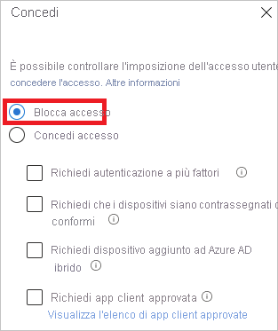
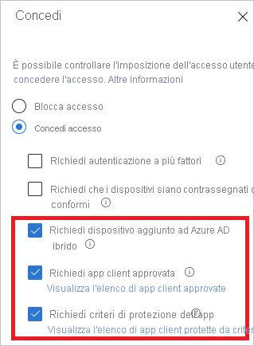
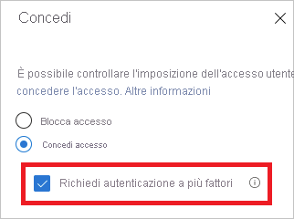

# Che cos'è la diagnostica per l'accesso di Azure AD?

Azure AD offre un modello di sicurezza flessibile che consente di controllare le operazioni che gli utenti possono eseguire con le risorse gestite. L'accesso a queste risorse viene controllato non solo in base a **chi** vi accede ma anche in base a **come** vi accede. In genere alla flessibilità è inevitabilmente associato un certo livello di complessità, dato il numero di opzioni di configurazione a disposizione. E con la complessità aumentano i rischi di errori.

Gli amministratori IT hanno bisogno di una soluzione che offra loro il giusto livello di visibilità sulle attività del sistema, in modo da poter diagnosticare e risolvere gli eventuali problemi con facilità. La diagnostica per l'accesso di Azure AD fa tutto questo. Consente di analizzare cosa è accaduto durante un accesso e identificare le azioni che è possibile intraprendere per risolvere i problemi senza bisogno di coinvolgere il supporto tecnico Microsoft.

Questo articolo fornisce una panoramica delle funzionalità di questa soluzione e del modo in cui è possibile usarla.

## Requisiti

La funzionalità di diagnostica per l'accesso è disponibile in tutte le edizioni di Azure AD.  Per usarla è necessario essere amministratore globale di Azure AD.

## Funzionamento

In Azure AD la risposta a un tentativo di accesso è legata a **chi** effettua il tentativo e a **come** accede al tenant. Ad esempio, un amministratore può in genere configurare tutti gli aspetti del tenant quando accede dalla rete aziendale. Se però accede con lo stesso account da una rete non attendibile, l'accesso potrebbe essere addirittura bloccato.
 
A causa della maggiore flessibilità offerta dal sistema per rispondere ai tentativi di accesso, ci si potrebbe trovare in situazioni in cui è necessario risolvere i problemi di accesso. La diagnostica per l'accesso è una funzionalità che:

- Analizza i dati degli accessi. 

- Mostra cosa è accaduto, insieme a suggerimenti per la risoluzione dei problemi. 

La diagnostica per l'accesso di Azure AD è progettata per consentire la diagnosi autonoma degli errori di accesso. Per completare il processo di diagnostica è necessario:

 
1. **Definire** l'ambito degli eventi di accesso di interesse

2. **Selezionare** l'accesso da esaminare

3. **Esaminare** il risultato della diagnostica

4. **Eseguire** le azioni necessarie

 
### Definire l'ambito

L'obiettivo di questo passaggio è definire l'ambito degli accessi da analizzare. L'ambito è basato su un utente o un identificatore (correlationId, requestId) e su un intervallo di tempo. Per limitare ulteriormente l'ambito, si può anche specificare un nome di app. Azure AD usa le informazioni sull'ambito per individuare gli eventi corretti.  

### Selezionare l'accesso  

In base ai criteri di ricerca, Azure AD recupera tutti gli accessi corrispondenti e li presenta in una visualizzazione elenco di riepilogo dell'autenticazione. 

 
È possibile personalizzare le colonne di questa visualizzazione.

### Esaminare la diagnostica 

Azure AD fornisce un risultato di diagnostica per l'evento di accesso selezionato. 

 
Il risultato inizia con una valutazione, che spiega in poche frasi cosa è accaduto. La spiegazione è utile per comprendere il comportamento del sistema. 

Nel passaggio successivo si ottiene un riepilogo dei criteri di accesso condizionale correlati applicati all'accesso selezionato. Questa parte viene completata con il suggerimento delle operazioni correttive da eseguire per risolvere il problema. Poiché non sempre è possibile risolvere i problemi senza ulteriore assistenza, un suggerimento potrebbe consistere nell'aprire un ticket di supporto. 

### Intervieni 
A questo punto si dovrebbe disporre delle informazioni necessarie per risolvere il problema.

## Scenari

Questa sezione fornisce una panoramica degli scenari di diagnostica implementati, ossia: 
 
- Accesso bloccato dai criteri di accesso condizionale

- Accesso condizionale non riuscito

- Autenticazione a più fattori in base ad accesso condizionale

- Autenticazione a più fattori in base ad altri requisiti

- Richiesta di configurazione dell'autenticazione a più fattori

- Richiesta di configurazione dell'autenticazione a più fattori con tentativo di accesso da una posizione non sicura

- Accesso riuscito

### Accesso bloccato dai criteri di accesso condizionale

Questo scenario è basato su un accesso bloccato da un criterio di accesso condizionale.

La sezione di diagnostica per questo scenario mostra informazioni dettagliate relative all'accesso utente e ai criteri applicati.

### Accesso condizionale non riuscito

Questo scenario è in genere il risultato di un accesso non riuscito perché i requisiti di un criterio di accesso condizionale non sono stati soddisfatti. Esempi comuni:

- Richiedere un dispositivo aggiunto ad Azure AD ibrido

- Richiedere app client approvata

- Richiedere criteri di protezione dell'app   

La sezione di diagnostica per questo scenario mostra informazioni dettagliate relative all'accesso utente e ai criteri applicati.

### Autenticazione a più fattori in base ad accesso condizionale

Questo scenario è basato su un criterio di accesso condizionale in cui è impostato il requisito di accesso con l'autenticazione a più fattori.

La sezione di diagnostica per questo scenario mostra informazioni dettagliate relative all'accesso utente e ai criteri applicati.

### Autenticazione a più fattori in base ad altri requisiti

Questo scenario è basato su un requisito di autenticazione a più fattori che non è stato applicato da un criterio di accesso condizionale, ad esempio l'autenticazione a più fattori in base ai singoli utenti.

Lo scopo di questo scenario di diagnostica è quello di fornire maggiori dettagli su:

- L'origine dell'interruzione dell'autenticazione a più fattori. 
- Il risultato dell'interazione del client.

Questa sezione fornisce anche tutti i dettagli relativi al tentativo di accesso dell'utente. 

### Richiesta di configurazione dell'autenticazione a più fattori

Questo scenario è basato sugli accessi interrotti da richieste di configurazione dell'autenticazione a più fattori. Questa configurazione è detta anche registrazione.

La richiesta di configurazione dell'autenticazione a più fattori avviene quando un utente deve usare questo tipo di autenticazione ma non l'ha ancora configurata o quando un amministratore ha configurato l'utente per configurarla.

Lo scopo di questo scenario di diagnostica è far comprendere che l'interruzione dell'autenticazione a più fattori è avvenuta perché è necessario configurarla e suggerire di richiedere all'utente di completarla.

### Richiesta di configurazione dell'autenticazione a più fattori da un accesso a rischio

Questo scenario è il risultato di accessi interrotti da una richiesta di configurazione dell'autenticazione a più fattori da un accesso a rischio. 

Lo scopo di questo scenario di diagnostica è far comprendere che l'interruzione dell'autenticazione a più fattori è avvenuta perché è necessario configurarla e suggerire di richiedere all'utente di completarla da un percorso di rete che non sia a rischio. Ad esempio, se una rete aziendale è definita come una località denominata, provare a eseguire la configurazione dalla rete aziendale.

### Accesso riuscito

Questo scenario è basato sugli accessi che non sono stati interrotti da criteri di accesso condizionale o da richieste di configurazione dell'autenticazione a più fattori.

Lo scopo di questo scenario di diagnostico è quello di fornire informazioni dettagliate sui dettagli forniti dall'utente durante l'accesso, nel caso in cui fossero applicati criteri di accesso condizionale o fosse configurata l'autenticazione a più fattori destinata a interrompere l'accesso dell'utente.

## Passaggi successivi

* [Che cosa sono i report di Azure Active Directory?](overview-reports.md)
* [Che cos'è il monitoraggio di Azure Active Directory?](overview-monitoring.md)
