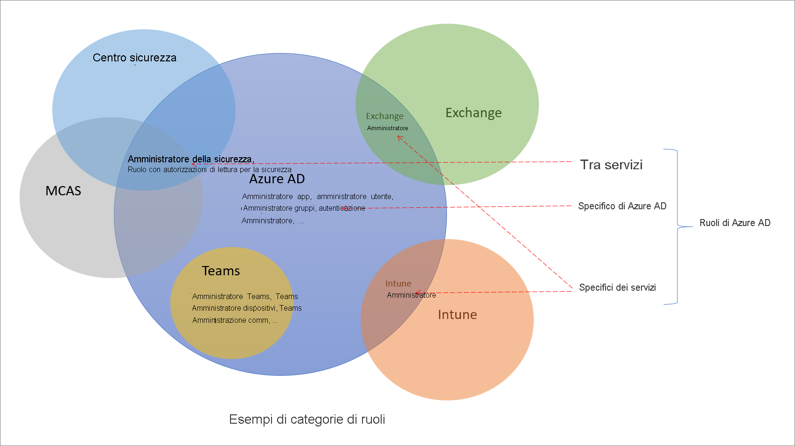

# Informazioni sui ruoli in Azure Active Directory

Azure Active Directory (Azure AD) include circa 60 ruoli predefiniti, che prevedono un set fisso di autorizzazioni. Per integrare i ruoli predefiniti, Azure AD supporta anche i ruoli personalizzati. Usare i ruoli personalizzati per selezionare le autorizzazioni adatte alle proprie esigenze. È ad esempio possibile creare un ruolo personalizzato per gestire specifiche risorse di Azure, come applicazioni o entità servizio.

Questo articolo descrive che cosa sono i ruoli di Azure AD e come possono essere usati.

## Differenze tra i ruoli di Azure AD e altri ruoli di Microsoft 365

Esistono molti servizi differenti in Microsoft 365, ad esempio Azure AD e Intune. Alcuni di questi servizi prevedono specifici sistemi di controllo degli accessi in base al ruolo, in particolare:

- Azure AD
- Exchange
- Intune
- Centro sicurezza
- Centro conformità
- Microsoft Cloud App Security
- Commercio

Altri servizi, come Teams, SharePoint e Managed Desktop, non includono sistemi di controllo degli accessi in base al ruolo separati, ma usano i ruoli di Azure AD per l'accesso amministrativo. Azure include un proprio sistema di controllo degli accessi in base al ruolo per risorse di Azure come le macchine virtuali e questo sistema è diverso dai ruoli di Azure AD.

Per sistema di controllo degli accessi in base al ruolo separato si intende che le definizioni e le assegnazioni di ruoli vengono archiviate in archivi dati differenti. Analogamente, le verifiche dell'accesso vengono eseguite in un Policy Decision Point differente. Per altre informazioni, vedere [Ruoli dei servizi di Microsoft 365 in Azure AD](m365-workload-docs.md) e [Ruoli di amministratore sottoscrizione classico, ruoli di Azure e ruoli di Azure AD](../../role-based-access-control/rbac-and-directory-admin-roles.md).

## Perché alcuni ruoli di Azure AD vengono usati per altri servizi

Microsoft 365 include diversi sistemi di controllo degli accessi in base al ruolo sviluppati indipendentemente nel corso del tempo, ognuno con uno specifico portale di servizi. Per semplificare la gestione delle identità in Microsoft 365 dal portale di Azure AD, sono stati aggiunti alcuni ruoli predefiniti specifici del servizio, ognuno dei quali concede l'accesso amministrativo a un servizio di Microsoft 365. Un esempio di questa aggiunta è il ruolo Amministratore di Exchange in Azure AD. Questo ruolo è equivalente al [gruppo di ruoli Gestione organizzazione](/exchange/organization-management-exchange-2013-help) del sistema di controllo degli accessi in base al ruolo di Exchange e consente di gestire tutti gli aspetti di Exchange. Analogamente, sono stati aggiunti i ruoli di amministratore di Intune, di Teams, di SharePoint e così via. I ruoli specifici del servizio rappresentano una delle categorie dei ruoli predefiniti di Azure AD descritte nella sezione seguente.

## Categorie dei ruoli di Azure AD

I ruoli predefiniti di Azure AD possono essere usati in risorse diverse e rientrano nelle tre categorie ampie seguenti.

- **Ruoli specifici di Azure AD**: questi ruoli concedono le autorizzazioni per gestire solo le risorse all'interno di Azure AD. Ad esempio, i ruoli Amministratore utenti, Amministratore applicazione e Amministratore gruppi concedono tutti le autorizzazioni per gestire le risorse esistenti in Azure AD.
- **Ruoli specifici del servizio**: per i principali servizi di Microsoft 365 (non Azure AD) esistono ruoli predefiniti specifici del servizio che concedono le autorizzazioni per gestire tutte le funzionalità all'interno di tale servizio.  Ad esempio i ruoli Amministratore di Exchange, Amministratore di Intune, Amministratore di SharePoint e Amministratore di Teams consentono di gestire le funzionalità dei rispettivi servizi. L'amministratore di Exchange può gestire le cassette postali, quello di Intune i criteri dei dispositivi, quello di SharePoint le raccolte siti, quello di Teams la qualità delle chiamate e così via.
- **Ruoli tra servizi**: alcuni ruoli si applicano a più servizi. Sono disponibili due ruoli globali, ovvero Amministratore globale e Ruolo con autorizzazioni di lettura globali. Questi due ruoli vengono rispettati in tutti i servizi di Microsoft 365. Inoltre, esistono alcuni ruoli legati alla sicurezza, come Amministratore della sicurezza e Ruolo con autorizzazioni di lettura per la sicurezza, che concedono l'accesso a molti servizi di sicurezza all'interno di Microsoft 365. Ad esempio, il ruolo Amministratore della sicurezza di Azure AD consente di gestire il Centro sicurezza di Microsoft 365, Advanced Threat Protection di Microsoft Defender e Microsoft Cloud App Security. Analogamente, il ruolo Amministratore di conformità consente di gestire le impostazioni relative alla conformità nel Centro conformità di Microsoft 365, in Exchange e così via.

La tabella seguente illustra queste categorie di ruoli. I nomi delle categorie sono arbitrari e non intendono implicare altre funzionalità oltre alle [autorizzazioni dei ruoli documentate](permissions-reference.md).

Category | Role
---- | ----
Ruoli specifici di Azure AD | Amministratore di applicazioni Sviluppatore di applicazioni Amministratore dell'autenticazione Amministratore dei set di chiavi IEF B2C Amministratore dei criteri IEF B2C Amministratore applicazione cloud Amministratore dispositivo cloud Amministratore accesso condizionale Amministratori di dispositivi Ruoli con autorizzazioni di lettura nella directory Account di sincronizzazione della directory Writer di directory ID esterno - Amministratore dei flussi utente ID esterno - Amministratore degli attributi dei flussi utente Amministratore dei provider di identità esterni Amministratore di gruppi Mittente dell'invito guest Amministratore del supporto tecnico Amministratore delle identità ibride Amministratore licenze Supporto partner - Livello 1 Supporto partner - Livello 2 Amministratore password Amministratore autenticazione con privilegi Amministratore dei ruoli con privilegi Lettore di report Amministratore account utente
Ruoli tra servizi | Amministratore società Amministratore di conformità Amministratore dati di conformità Ruolo con autorizzazioni di lettura globali Amministratore della protezione Operatore di sicurezza Ruolo con autorizzazioni di lettura per la sicurezza Amministratore del supporto servizio
Ruoli specifici del servizio | Amministratore di Azure DevOps Amministratore di Azure Information Protection Amministratore fatturazione Amministratore del servizio CRM Responsabile approvazione per l'accesso a Customer Lockbox Amministratore di Desktop Analytics Amministratore del servizio Exchange Amministratore di Insights Leader aziendale di Insights Amministratore del servizio Intune Amministratore di Kaizala Amministratore del servizio Lync Ruolo con autorizzazioni di lettura per la privacy del Centro messaggi Ruolo con autorizzazioni di lettura per il Centro messaggi Utente Commerce moderno Amministratore di rete Amministratore delle app di Office Amministratore del servizio Power BI Amministratore di Power Platform Amministratore stampante Tecnico della stampante Amministratore della ricerca Editor della ricerca Amministratore del servizio SharePoint Amministratore comunicazioni Teams Tecnico di supporto comunicazioni Teams Specialista di supporto comunicazioni Teams Amministratore di dispositivi di Teams Amministratore del servizio Teams

## Passaggi successivi

- [Panoramica del controllo degli accessi in base al ruolo di Azure AD](custom-overview.md)
- Creare assegnazioni di ruolo usando il [portale di Azure, Azure AD PowerShell e l'API Graph](custom-create.md)
- [Visualizzare le assegnazioni per un ruolo](custom-view-assignments.md)
