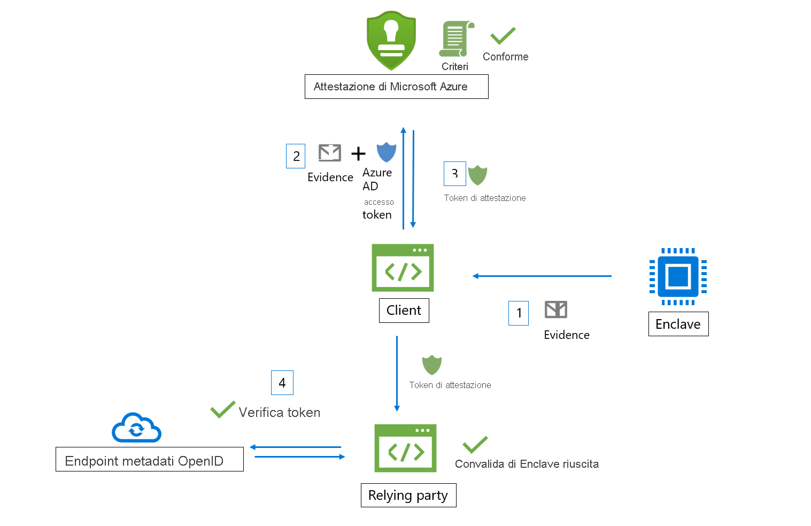

# Flusso di lavoro

Il servizio Attestazione di Microsoft Azure riceve l'evidenza dalle enclavi e la valuta rispetto alla baseline di sicurezza di Azure e a criteri configurabili. Al completamento della verifica, il servizio genera un token di attestazione per confermare l'attendibilità dell'enclave.

In un flusso di lavoro di Attestazione di Azure sono coinvolti gli attori seguenti:

- **Relying party**: il componente che si basa su Attestazione di Azure per verificare la validità dell'enclave. 
- **Client**: il componente che raccoglie informazioni da un'enclave e invia richieste ad Attestazione di Azure. 
- **Attestazione di Azure**: il componente che accetta l'evidenza dell'enclave dal client, la convalida e restituisce il token di attestazione al client

## Flusso di lavoro di convalida dell'enclave di Intel® Software Guard Extensions (SGX)

Ecco i passaggi generali di un tipico flusso di lavoro di attestazione dell'enclave SGX enclave (usando Attestazione di Azure):

1. Il client raccoglie l'evidenza da un'enclave. L'evidenza è costituita da informazioni sull'ambiente dell'enclave e sulla libreria client in esecuzione nell'enclave.
1. Il client ha un URI che fa riferimento a un'istanza di Attestazione di Azure. Il client invia l'evidenza ad Attestazione di Azure. Le informazioni esatte inviate al provider variano in base al tipo di enclave.
1. Attestazione di Azure convalida le informazioni inviate e le valuta rispetto a un criterio configurato. Se la verifica ha esito positivo, Attestazione di Azure emette un token di attestazione e lo restituisce al client. Se questo passaggio ha esito negativo, Attestazione di Azure segnala un errore al client. 
1. Il client invia il token di attestazione alla relying party. La relying party chiama l'endpoint di metadati con chiave pubblica di Attestazione di Azure per recuperare i certificati di firma. La relying party verifica quindi la firma del token di attestazione e garantisce l'attendibilità dell'enclave. 

> [!Note]
> Quando si inviano richieste di attestazione nella versione [2018-09-01-preview](https://github.com/Azure/azure-rest-api-specs/tree/master/specification/attestation/data-plane/Microsoft.Attestation/stable/2018-09-01-preview) dell'API, il client deve inviare l'evidenza ad Attestazione di Azure insieme al token di accesso di Azure AD.

## Flusso di lavoro di convalida dell'enclave Trusted Platform Module (TPM)

Di seguito sono riportati i passaggi generali di un flusso di lavoro di attestazione dell'enclave TPM tipico (usando l'attestazione di Azure):

1.  Nell'avvio del dispositivo/della piattaforma, diversi caricatori di avvio e servizi di avvio misurano gli eventi supportati dal TPM e archiviati in modo sicuro (log TCG).
2.  Il client raccoglie i log TCG dal dispositivo e dalla virgoletta TPM, che funge da evidenza per l'attestazione.
3.  Il client ha un URI che fa riferimento a un'istanza di Attestazione di Azure. Il client invia l'evidenza ad Attestazione di Azure. Le informazioni esatte inviate al provider dipendono dalla piattaforma.
4.  Attestazione di Azure convalida le informazioni inviate e le valuta rispetto a un criterio configurato. Se la verifica ha esito positivo, Attestazione di Azure emette un token di attestazione e lo restituisce al client. Se questo passaggio ha esito negativo, Attestazione di Azure segnala un errore al client. La comunicazione tra il client e il servizio di attestazione è determinata dal protocollo TPM di attestazione di Azure.
5.  Il client invia quindi il token di attestazione a relying party. La relying party chiama l'endpoint di metadati con chiave pubblica di Attestazione di Azure per recuperare i certificati di firma. Il relying party verifica quindi la firma del token di attestazione e garantisce l'affidabilità delle piattaforme.

## Passaggi successivi
- [Come creare e firmare un criterio di attestazione](author-sign-policy.md)
- [Configurare Attestazione di Azure con PowerShell](quickstart-powershell.md)
