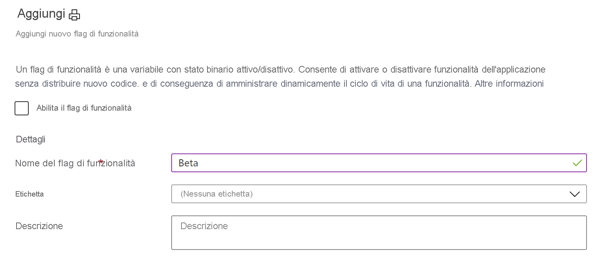

# <a name="quickstart-add-feature-flags-to-an-azure-functions-app"></a>Avvio rapido: Aggiungere flag di funzionalità a un'app di Funzioni di Azure

In questa guida di avvio rapido si crea un'app di Funzioni di Azure in cui si useranno i flag di funzionalità. Si usa la gestione delle funzionalità del servizio Configurazione app per archiviare centralmente tutti i flag di funzionalità e controllarne gli stati.

Le librerie di Gestione funzionalità di .NET estendono il framework con il supporto per i flag di funzionalità. Queste librerie si basano sul sistema di configurazione di .NET. Si integrano con Configurazione app tramite il provider di configurazione di .NET.

## <a name="prerequisites"></a>Prerequisiti

- Sottoscrizione di Azure: [creare un account gratuito](https://azure.microsoft.com/free/)
- [Visual Studio 2019](https://visualstudio.microsoft.com/vs) con il carico di lavoro **Sviluppo di Azure**.
- [Strumenti di Funzioni di Azure](../azure-functions/functions-develop-vs.md#check-your-tools-version)

## <a name="create-an-app-configuration-store"></a>Creare un archivio di Configurazione app

[!INCLUDE [azure-app-configuration-create](../../includes/azure-app-configuration-create.md)]

7. Selezionare **Gestione funzionalità** >  **+Aggiungi** per aggiungere un flag funzionalità denominato `Beta`.

    > [!div class="mx-imgBorder"]
    > 

    Per il momento lasciare `label` e `Description` non definiti.

8. Selezionare **Applica** per salvare il nuovo flag di funzionalità.

## <a name="create-a-functions-app"></a>Creare un'app Funzioni

[!INCLUDE [Create a project using the Azure Functions template](../../includes/functions-vstools-create.md)]

## <a name="connect-to-an-app-configuration-store"></a>Connettersi a un archivio di Configurazione app

Questo progetto usa l'[inserimento di dipendenze in Funzioni di Azure .NET](../azure-functions/functions-dotnet-dependency-injection.md). Aggiunge Configurazione app di Azure come origine di configurazione supplementare in cui vengono archiviati i flag di funzionalità.

1. Fare clic con il pulsante destro del mouse sul progetto e scegliere **Gestisci pacchetti NuGet**. Nella scheda **Sfoglia** cercare e aggiungere i pacchetti NuGet seguenti al progetto.
   - [Microsoft.Extensions.Configuration.AzureAppConfiguration](https://www.nuget.org/packages/Microsoft.Extensions.Configuration.AzureAppConfiguration/) versione 4.1.0 o successiva
   - [Microsoft.FeatureManagement](https://www.nuget.org/packages/Microsoft.FeatureManagement/) versione 2.2.0 o successiva
   - [Microsoft.Azure.Functions.Extensions](https://www.nuget.org/packages/Microsoft.Azure.Functions.Extensions/) versione 1.1.0 o successiva 

2. Aggiungere un nuovo file, *Startup.cs*, con il codice seguente. Definisce una classe denominata `Startup` che implementa la classe astratta `FunctionsStartup`. Viene usato un attributo di assembly per specificare il nome del tipo usato durante l'avvio di Funzioni di Azure.

    ```csharp
    using System;
    using Microsoft.Azure.Functions.Extensions.DependencyInjection;
    using Microsoft.Extensions.Configuration;
    using Microsoft.FeatureManagement;

    [assembly: FunctionsStartup(typeof(FunctionApp.Startup))]

    namespace FunctionApp
    {
        class Startup : FunctionsStartup
        {
            public override void ConfigureAppConfiguration(IFunctionsConfigurationBuilder builder)
            {
            }

            public override void Configure(IFunctionsHostBuilder builder)
            {
            }
        }
    }
    ```


3. Aggiornare il metodo `ConfigureAppConfiguration` e aggiungere il provider di Configurazione app di Azure come origine di configurazione supplementare chiamando `AddAzureAppConfiguration()`. 

   Il metodo `UseFeatureFlags()` indica al provider di caricare i flag di funzionalità. Tutti i flag di funzionalità hanno una scadenza della cache predefinita di 30 secondi prima di ricontrollare le modifiche. L'intervallo di scadenza può essere aggiornato impostando la proprietà `FeatureFlagsOptions.CacheExpirationInterval` passata al metodo `UseFeatureFlags`. 

    ```csharp
    public override void ConfigureAppConfiguration(IFunctionsConfigurationBuilder builder)
    {
        builder.ConfigurationBuilder.AddAzureAppConfiguration(options =>
        {
            options.Connect(Environment.GetEnvironmentVariable("ConnectionString"))
                   .Select("_")
                   .UseFeatureFlags();
        });
    }
    ```
   > [!TIP]
   > Per evitare che nell'applicazione vengano caricate configurazioni diverse dai flag di funzionalità, è possibile chiamare `Select("_")` per caricare solo una chiave fittizia inesistente "_". Per impostazione predefinita, se non viene chiamato un metodo `Select`, vengono caricate tutte le coppie chiave-valore di configurazione presenti nell'archivio di Configurazione app.

4. Aggiornare il metodo `Configure` per rendere disponibili i servizi di Configurazione app di Azure e di gestione delle funzionalità tramite l'inserimento di dipendenze.

    ```csharp
    public override void Configure(IFunctionsHostBuilder builder)
    {
        builder.Services.AddAzureAppConfiguration();
        builder.Services.AddFeatureManagement();
    }
    ```

5. Aprire *Function1.cs* e aggiungere gli spazi dei nomi seguenti.

    ```csharp
    using System.Linq;
    using Microsoft.FeatureManagement;
    using Microsoft.Extensions.Configuration.AzureAppConfiguration;
    ```

   Aggiungere un costruttore usato per ottenere le istanze di `_featureManagerSnapshot` e `IConfigurationRefresherProvider` tramite l'inserimento di dipendenze. Da `IConfigurationRefresherProvider`è possibile ottenere l'istanza di `IConfigurationRefresher`.

    ```csharp
    private readonly IFeatureManagerSnapshot _featureManagerSnapshot;
    private readonly IConfigurationRefresher _configurationRefresher;

    public Function1(IFeatureManagerSnapshot featureManagerSnapshot, IConfigurationRefresherProvider refresherProvider)
    {
        _featureManagerSnapshot = featureManagerSnapshot;
        _configurationRefresher = refresherProvider.Refreshers.First();
    }
    ```

6. Aggiornare il metodo `Run` per cambiare il valore del messaggio visualizzato in base allo stato del flag di funzionalità.

   Il metodo `TryRefreshAsync` viene chiamato all'inizio della chiamata a Funzioni per aggiornare i flag di funzionalità. Questa operazione non verrà eseguita se non viene raggiunta la finestra temporale di scadenza della cache. Rimuovere l'operatore `await` se si preferisce che i flag di funzionalità vengano aggiornati senza bloccare la chiamata a Funzioni corrente. In tal caso, le successive chiamate a Funzioni riceveranno il valore aggiornato.

    ```csharp
    [FunctionName("Function1")]
    public async Task<IActionResult> Run(
        [HttpTrigger(AuthorizationLevel.Anonymous, "get", "post", Route = null)] HttpRequest req,
        ILogger log)
    {
        log.LogInformation("C# HTTP trigger function processed a request.");

        await _configurationRefresher.TryRefreshAsync();

        string message = await _featureManagerSnapshot.IsEnabledAsync("Beta")
                ? "The Feature Flag 'Beta' is turned ON"
                : "The Feature Flag 'Beta' is turned OFF";

        return (ActionResult)new OkObjectResult(message);
    }
    ```

## <a name="test-the-function-locally"></a>Testare la funzione in locale

1. Impostare una variabile di ambiente denominata **ConnectionString**, il cui valore è la stringa di connessione recuperata in precedenza nell'archivio di Configurazione app in **Chiavi di accesso**. Se si usa il prompt dei comandi di Windows, eseguire il comando seguente e riavviare il prompt per rendere effettiva la modifica:

    ```cmd
        setx ConnectionString "connection-string-of-your-app-configuration-store"
    ```

    Se si usa Windows PowerShell, eseguire il comando seguente:

    ```azurepowershell
        $Env:ConnectionString = "connection-string-of-your-app-configuration-store"
    ```

    Se si usa macOS o Linux, eseguire il comando seguente:

    ```bash
        export ConnectionString='connection-string-of-your-app-configuration-store'
    ```

1. Premere F5 per testare la funzione. Se viene visualizzata, accettare la richiesta di Visual Studio di scaricare e installare gli strumenti dell'**interfaccia della riga di comando Azure Functions Core Tools**. Potrebbe essere necessario anche abilitare un'eccezione del firewall per consentire agli strumenti di gestire le richieste HTTP.

1. Copiare l'URL della funzione dall'output di runtime di Funzioni di Azure.

    

1. Incollare l'URL per la richiesta HTTP nella barra degli indirizzi del browser. L'immagine seguente mostra la risposta che indica che il flag di funzionalità `Beta` è disabilitato. 

    

1. Accedere al [portale di Azure](https://portal.azure.com). Selezionare **Tutte le risorse** e quindi l'archivio di Configurazione app creato.

1. Selezionare **Gestione funzionalità** e cambiare lo stato della chiave **Beta** impostandolo su **Sì**.

1. Aggiornare alcune volte il browser. Quando il flag di funzionalità memorizzato nella cache scade dopo 30 secondi, la pagina dovrebbe cambiare per indicare che il flag di funzionalità `Beta` è attivato, come illustrato nell'immagine seguente.
 
    

> [!NOTE]
> Il codice di esempio usato in questa esercitazione può essere scaricato dal [repository GitHub di Configurazione app di Azure](https://github.com/Azure/AppConfiguration/tree/master/examples/DotNetCore/AzureFunction).

## <a name="clean-up-resources"></a>Pulire le risorse

[!INCLUDE [azure-app-configuration-cleanup](../../includes/azure-app-configuration-cleanup.md)]

## <a name="next-steps"></a>Passaggi successivi

In questo argomento di avvio rapido è stato creato un flag di funzionalità che è stato usato con un'app di Funzioni di Azure tramite la libreria [Microsoft.FeatureManagement](/dotnet/api/microsoft.featuremanagement).

- Altre informazioni sulla [gestione delle funzionalità](./concept-feature-management.md)
- [Gestire i flag di funzionalità](./manage-feature-flags.md)
- [Usare i flag della funzionalità condizionale](./howto-feature-filters-aspnet-core.md)
- [Abilitare l'implementazione a fasi di funzionalità per destinatari specifici](./howto-targetingfilter-aspnet-core.md)
- [Usare la configurazione dinamica in un'app di Funzioni di Azure](./enable-dynamic-configuration-azure-functions-csharp.md)