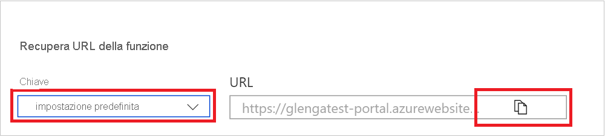

# Creare la prima funzione nel portale di Azure

Funzioni di Azure consente di eseguire il codice in un ambiente serverless senza dover prima creare una macchina virtuale o pubblicare un'applicazione Web. Questo articolo illustra come usare Funzioni di Azure per creare una funzione trigger HTTP "hello world" nel portale di Azure.

[!INCLUDE [functions-in-portal-editing-note](../../includes/functions-in-portal-editing-note.md)] 

È invece consigliabile sviluppare [le funzioni in locale e](functions-develop-local.md) pubblicare in un'app per le funzioni in Azure.  
Usare uno dei collegamenti seguenti per iniziare a usare il linguaggio e l'ambiente di sviluppo locale scelti:

| Visual Studio Code | Terminale/prompt dei comandi | Visual Studio |
| --- | --- | --- |
|  &bull;&nbsp;[Introduzione a C #](./create-first-function-vs-code-csharp.md) &bull;&nbsp;[Introduzione a Java](./create-first-function-vs-code-java.md) &bull;&nbsp;[Introduzione a JavaScript](./create-first-function-vs-code-node.md) &bull;&nbsp;[Introduzione a PowerShell](./create-first-function-vs-code-powershell.md) &bull;&nbsp;[Introduzione a Python](./create-first-function-vs-code-python.md) |&bull;&nbsp;[Introduzione a C #](./create-first-function-cli-csharp.md) &bull;&nbsp;[Introduzione a Java](./create-first-function-cli-java.md) &bull;&nbsp;[Introduzione a JavaScript](./create-first-function-cli-node.md) &bull;&nbsp;[Introduzione a PowerShell](./create-first-function-cli-powershell.md) &bull;&nbsp;[Introduzione a Python](./create-first-function-cli-python.md) | [Introduzione a C#](functions-create-your-first-function-visual-studio.md) |

[!INCLUDE [quickstarts-free-trial-note](../../includes/quickstarts-free-trial-note.md)]

## Accedere ad Azure

Accedere al [portale di Azure](https://portal.azure.com) con il proprio account Azure.

## Creare un'app per le funzioni

Per ospitare l'esecuzione delle funzioni è necessaria un'app per le funzioni. Un'app per le funzioni consente di raggruppare le funzioni come un'unità logica per semplificare la gestione, la distribuzione, il ridimensionamento e la condivisione delle risorse.

[!INCLUDE [Create function app Azure portal](../../includes/functions-create-function-app-portal.md)]

Creare quindi una funzione nella nuova app per le funzioni.

## Creare una funzione Trigger HTTP

1. Selezionare **Funzioni** nel menu a sinistra della finestra **Funzioni** e quindi **Aggiungi** nel menu in alto. 
 
1. Nella finestra **Aggiungi funzione** selezionare il modello di **trigger Http.**

    

1. In **Dettagli modello** usare per Nuova funzione scegliere Anonimo nell'elenco a discesa Livello di autorizzazione e quindi selezionare `HttpExample` **Aggiungi**.   ****

    A questo punto Azure crea la funzione Trigger HTTP. Ora è possibile eseguire la nuova funzione inviando una richiesta HTTP.

## Testare la funzione

1. Nella nuova funzione Trigger HTTP, selezionare **Codice + test** dal menu a sinistra, quindi selezionare **Ottieni URL funzione** dal menu in alto.

    

1. Nella finestra di dialogo **Ottieni URL funzione**, selezionare **Predefinito** dall'elenco a discesa, quindi l'icona **Copia negli Appunti**. 

    

1. Incollare l'URL della funzione nella barra degli indirizzi del browser. Aggiungere il valore della stringa di query `?name=<your_name>` alla fine dell'URL e premere INVIO per eseguire la richiesta. Il browser dovrebbe visualizzare un messaggio di risposta che restituisce il valore della stringa di query. 

    Se l'URL della richiesta include una [chiave di accesso](functions-bindings-http-webhook-trigger.md#authorization-keys) ( ), significa che si sceglie Funzione anziché Il livello di accesso anonimo durante la creazione della `?code=...` funzione.   In questo caso, è invece necessario aggiungere `&name=<your_name>` .

1. Quando viene eseguita la funzione, vengono scritte nei log informazioni di traccia. Per visualizzare l'output di traccia, tornare alla pagina **Codice + test** nel portale ed espandere la freccia **Log** nella parte inferiore della pagina. Chiamare di nuovo la funzione per visualizzare l'output di traccia scritto nei log. 

    :::image type="content" source="media/functions-create-first-azure-function/function-view-logs.png" alt-text="Visualizzatore log di Funzioni nel portale di Azure":::

## Pulire le risorse

[!INCLUDE [Clean-up resources](../../includes/functions-quickstart-cleanup.md)]

## Passaggi successivi

[!INCLUDE [Next steps note](../../includes/functions-quickstart-next-steps.md)]
