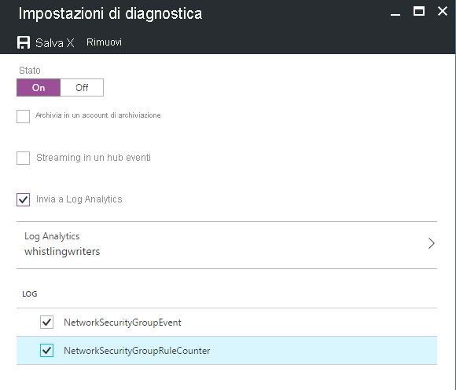
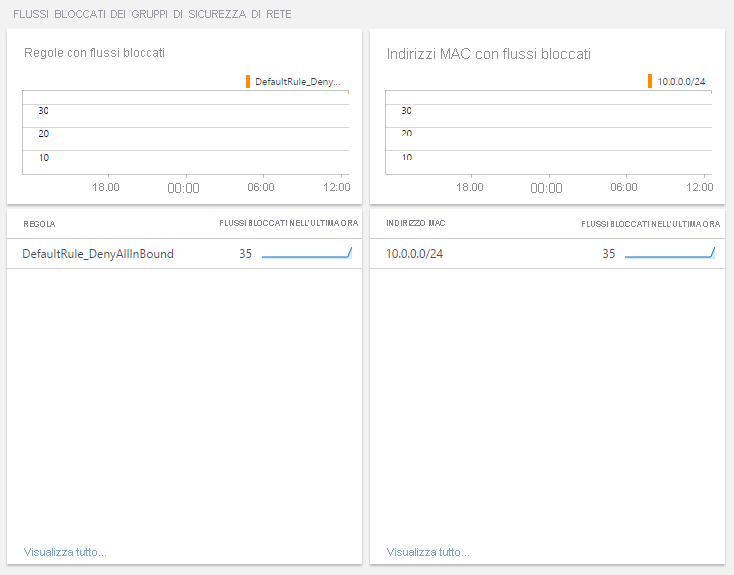
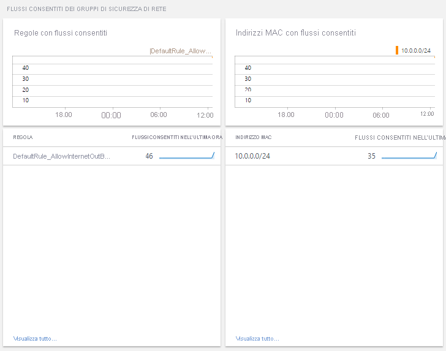

# <a name="azure-networking-monitoring-solutions-in-azure-monitor"></a>Soluzioni di monitoraggio di rete di Azure in Monitoraggio di Azure

[!INCLUDE [updated-for-az](../../../includes/updated-for-az.md)]

Monitoraggio di Azure offre le seguenti soluzioni per il monitoraggio delle reti:
* Monitoraggio delle prestazioni di rete per
    * Verificare l'integrità della rete
* Azure Application Gateway Analytics per analizzare
    * Log di gateway applicazione di Azure
    * Metriche di gateway applicazione di Azure
* Soluzioni per monitorare e controllare l'attività della rete cloud
    * [Analisi del traffico](../../networking/network-monitoring-overview.md#traffic-analytics) 
    * Analisi del gruppo di sicurezza di rete di Azure

## <a name="network-performance-monitor-npm"></a>Monitoraggio delle prestazioni di rete

La soluzione di gestione [Monitoraggio delle prestazioni di rete](../../networking/network-monitoring-overview.md) consente di monitorare l'integrità, la disponibilità e la raggiungibilità delle reti.  Viene usata per monitorare la connettività tra:

* Cloud pubblico e risorse locali
* Data center e percorsi utente (succursali)
* Subnet che ospitano vari livelli di un'applicazione multilivello.

Per altre informazioni, vedere [Monitoraggio delle prestazioni di rete](../../networking/network-monitoring-overview.md).

## <a name="network-security-group-analytics"></a>Analisi del gruppo di sicurezza di rete

1. Aggiungere la soluzione di gestione a Monitoraggio di Azure e
2. Abilitare la funzionalità diagnostica per indirizzare la diagnostica a un'area di lavoro Log Analytics in Monitoraggio di Azure. Non è necessario inserire i log nell'Archiviazione BLOB di Azure.

Se i log di diagnostica non sono abilitati, i pannelli del dashboard per quella risorsa sono vuoti e visualizzano un messaggio di errore.

## <a name="azure-application-gateway-analytics"></a>Analisi gateway applicazione di Azure

1. Abilitare la funzionalità diagnostica per indirizzare la diagnostica a un'area di lavoro Log Analytics in Monitoraggio di Azure.
2. Utilizzare il riepilogo dettagliato per la risorsa utilizzando il modello di cartella di lavoro per il gateway applicazione.

Se i log di diagnostica non sono abilitati per il gateway applicazione, solo i dati della metrica predefiniti verranno popolati nella cartella di lavoro.


> [!NOTE]
> A gennaio 2017 è stato modificato il metodo supportato per inviare i log dai gateway applicazione e dai gruppi di sicurezza di rete all'area di lavoro Log Analytics. Se viene visualizzata la soluzione **Azure Networking Analytics (deprecata)** , fare riferimento ai passaggi di [migrazione dalla vecchia soluzione Networking Analytics](#migrating-from-the-old-networking-analytics-solution) per istruzioni su come procedere.
>
>

## <a name="review-azure-networking-data-collection-details"></a>Esaminare i dettagli della raccolta di dati di rete di Azure
Le soluzioni di gestione delle analisi del gateway applicazione e del gruppo di sicurezza di rete di Azure raccolgono i log di diagnostica direttamente dalle due risorse appena citate. Non è necessario inserire i log in Archiviazione BLOB di Azure né è necessario alcun agente per la raccolta dati.

La tabella seguente illustra i metodi di raccolta dei dati e altri dettagli sulla modalità di raccolta dei dati per l'analisi del gateway applicazione e il gruppo di sicurezza di rete di Azure.

| Piattaforma | Agente diretto | Agente di Systems Center Operations Manager | Azure | È necessario Operations Manager? | Dati dell'agente Operations Manager inviati con il gruppo di gestione | Frequenza della raccolta |
| --- | --- | --- | --- | --- | --- | --- |
| Azure |  |  |&#8226; |  |  |Quando connesso |


### <a name="enable-azure-application-gateway-diagnostics-in-the-portal"></a>Abilitare la diagnostica del gateway applicazione di Azure nel portale

1. Nel portale di Azure passare alla risorsa Gateway applicazione da monitorare.
2. Selezionare *impostazioni di diagnostica* per aprire la pagina seguente.

   

   [](media/azure-networking-analytics/application-gateway-diagnostics-2.png#lightbox)

5. Selezionare la casella di controllo *Invia a Log Analytics*.
6. Selezionare un'area di lavoro Log Analytics esistente o crearne una.
7. Selezionare la casella di controllo in **Log** per ciascuno dei tipi di log da raccogliere.
8. Fare clic su *Salva* per abilitare la registrazione della diagnostica per Monitoraggio di Azure.

#### <a name="enable-azure-network-diagnostics-using-powershell"></a>Abilitare la diagnostica di rete di Azure tramite PowerShell

Lo script PowerShell seguente contiene un esempio su come abilitare la registrazione delle risorse per i gateway applicazione.

```powershell
$workspaceId = "/subscriptions/d2e37fee-1234-40b2-5678-0b2199de3b50/resourcegroups/oi-default-east-us/providers/microsoft.operationalinsights/workspaces/rollingbaskets"

$gateway = Get-AzApplicationGateway -Name 'ContosoGateway'

Set-AzDiagnosticSetting -ResourceId $gateway.ResourceId  -WorkspaceId $workspaceId -Enabled $true
```

#### <a name="accessing-azure-application-gateway-analytics-via-azure-monitor-network-insights"></a>Accesso a applicazione Azure gateway Analytics tramite monitoraggio di Azure Network Insights

È possibile accedere a Application Insights tramite la scheda Insights all'interno della risorsa del gateway applicazione.


La scheda "Visualizza metriche dettagliate" apre la cartella di lavoro pre-popolata che riepiloga i dati del gateway applicazione.

[](media/azure-networking-analytics/application-gateway-workbook.png#lightbox)

### <a name="new-capabilities-with-azure-monitor-network-insights-workbook"></a>Nuove funzionalità con la cartella di lavoro di Network Insights di monitoraggio di Azure

> [!NOTE]
> Alla cartella di lavoro di Azure monitor Insights non sono associati costi aggiuntivi. L'area di lavoro Log Analytics continuerà a essere fatturata in base all'utilizzo.

La cartella di lavoro di Network Insights consente di sfruttare le funzionalità più recenti di monitoraggio di Azure e Log Analytics tra cui:

* Console centralizzata per il monitoraggio e la risoluzione dei problemi con i dati di [metrica](../insights/network-insights-overview.md#resource-health-and-metrics) e di log.

* Area di disegno flessibile per supportare la creazione di [visualizzazioni](../visualize/workbooks-overview.md#visualizations)personalizzate avanzate.

* Possibilità di utilizzare e [condividere modelli di cartelle di lavoro](../visualize/workbooks-overview.md#workbooks-versus-workbook-templates) con community più ampia.

Per ulteriori informazioni sulle funzionalità della nuova soluzione cartella di lavoro [, vedere cartelle di lavoro-Panoramica](../visualize/workbooks-overview.md)

## <a name="migrating-from-azure-gateway-analytics-solution-to-azure-monitor-workbooks"></a>Migrazione dalla soluzione Azure gateway Analytics alle cartelle di lavoro di monitoraggio di Azure

> [!NOTE]
> La cartella di lavoro di Azure monitor network Insights è la soluzione consigliata per l'accesso alle metriche e ai log Analytics per le risorse del gateway applicazione.

1. Verificare che [le impostazioni di diagnostica siano abilitate](#enable-azure-application-gateway-diagnostics-in-the-portal) per archiviare i log in un'area di lavoro log Analytics. Se è già configurato, la cartella di lavoro di Azure monitor network Insights sarà in grado di utilizzare i dati dallo stesso percorso e non saranno necessarie altre modifiche.

> [!NOTE]
> Tutti i dati precedenti sono già disponibili all'interno della cartella di lavoro dal punto in cui sono state originariamente abilitate le impostazioni di diagnostica. Non è necessario alcun trasferimento dei dati.

2. Accedere alla [cartella di lavoro di Insights predefinita](#accessing-azure-application-gateway-analytics-via-azure-monitor-network-insights) per la risorsa del gateway applicazione. Tutte le informazioni dettagliate esistenti supportate dalla soluzione di analisi del gateway applicazione saranno già presenti nella cartella di lavoro. Per estendere questo problema, è possibile aggiungere [visualizzazioni](../visualize/workbooks-overview.md#visualizations) personalizzate basate sulla metrica & i dati di log.

3. Dopo aver visualizzato tutte le informazioni dettagliate sulle metriche e i log, per pulire la soluzione Azure gateway Analytics dall'area di lavoro, è possibile eliminare la soluzione dalla pagina delle risorse della soluzione.

[](media/azure-networking-analytics/application-gateway-analytics-delete.png#lightbox)

## <a name="azure-network-security-group-analytics-solution-in-azure-monitor"></a>Soluzione di analisi del gruppo di sicurezza di rete di Azure in Monitoraggio di Azure


> [!NOTE]
> La soluzione Analisi gruppo di sicurezza di rete sta per essere destinata al supporto della community in quanto la relativa funzionalità è stata sostituita da [Analisi del traffico](../../network-watcher/traffic-analytics.md).
> - La soluzione è ora disponibile in [Modelli di avvio rapido di Azure](https://azure.microsoft.com/resources/templates/oms-azurensg-solution/) e presto non sarà più disponibile in Azure Marketplace.
> - Per i clienti esistenti che hanno già aggiunto la soluzione all'area di lavoro, questa continuerà a funzionare senza modifiche.
> - Microsoft continuerà a supportare l'invio di log di risorse dei gruppi di sicurezza di rete all'area di lavoro usando Impostazioni di diagnostica.

I log seguenti sono supportati per i gruppi di sicurezza di rete:

* NetworkSecurityGroupEvent
* NetworkSecurityGroupRuleCounter

### <a name="install-and-configure-the-solution"></a>Installare e configurare la soluzione
Usare le istruzioni seguenti per installare e configurare la soluzione Azure Networking Analytics di Azure:

1. Abilitare la soluzione di analisi del gruppo di sicurezza di rete di Azure seguendo la procedura illustrata in [Aggiungere soluzioni di Monitoraggio di Azure dalla raccolta di soluzioni](./solutions.md).
2. Abilitare la registrazione diagnostica per le risorse [gruppo di sicurezza di rete](../../virtual-network/virtual-network-nsg-manage-log.md) da monitorare.

### <a name="enable-azure-network-security-group-diagnostics-in-the-portal"></a>Abilitare la diagnostica del gruppo di sicurezza di rete di Azure nel portale

1. Nel portale di Azure passare alla risorsa gruppo di sicurezza di rete da monitorare
2. Selezionare *Log di diagnostica* per aprire la pagina seguente

   
3. Fare clic su *Attiva diagnostica* per aprire la pagina seguente

   
4. Per attivare la diagnostica, fare clic su *Attivato* in *Stato*
5. Selezionare la casella di controllo *Send to Log Analytics* (Invia a Log Analytics)
6. Selezionare un'area di lavoro Log Analytics esistente o creare una
7. Selezionare la casella di controllo in **Log** per ciascuno dei tipi di log da raccogliere
8. Fare clic su *Salva* per abilitare la registrazione della diagnostica per Log Analytics

### <a name="enable-azure-network-diagnostics-using-powershell"></a>Abilitare la diagnostica di rete di Azure tramite PowerShell

Lo script PowerShell seguente contiene un esempio su come abilitare la registrazione di risorse per i gruppi di sicurezza di rete
```powershell
$workspaceId = "/subscriptions/d2e37fee-1234-40b2-5678-0b2199de3b50/resourcegroups/oi-default-east-us/providers/microsoft.operationalinsights/workspaces/rollingbaskets"

$nsg = Get-AzNetworkSecurityGroup -Name 'ContosoNSG'

Set-AzDiagnosticSetting -ResourceId $nsg.ResourceId  -WorkspaceId $workspaceId -Enabled $true
```

### <a name="use-azure-network-security-group-analytics"></a>Usare l'analisi del gruppo di sicurezza di rete di Azure
Dopo aver selezionato il riquadro **di analisi del gruppo di sicurezza di rete di Azure** nella panoramica, è possibile visualizzare i riepiloghi dei log e quindi analizzare i dettagli per le categorie seguenti:

* Flussi bloccati dei gruppi di sicurezza di rete
  * Regole dei gruppi di sicurezza di rete con flussi bloccati
  * Indirizzi MAC con flussi bloccati
* Flussi consentiti dei gruppi di sicurezza di rete
  * Regole dei gruppi di sicurezza di rete con flussi consentiti
  * Indirizzi MAC con flussi consentiti





Nel dashboard **di analisi del gruppo di sicurezza di rete di Azure** esaminare le informazioni di riepilogo in uno dei pannelli, quindi fare clic su un pannello per visualizzare le informazioni dettagliate nella pagina di ricerca di log.

In una pagina di ricerca di log qualsiasi è possibile visualizzare i risultati in base all'ora, ai dettagli e alla cronologia di ricerca. È anche possibile filtrare per facet in modo da limitare i risultati.

## <a name="migrating-from-the-old-networking-analytics-solution"></a>Migrazione dalla vecchia soluzione Networking Analytics
A gennaio 2017 è stato modificato il metodo supportato per inviare i log dai gateway applicazione e dai gruppi di sicurezza di rete di Azure all'area di lavoro Log Analytics. In questo modo si otterranno i vantaggi seguenti:
+ I log vengono scritti direttamente in Monitoraggio di Azure senza la necessità di usare un account di archiviazione
+ Minore latenza dal momento in cui i log vengono generati, essendo immediatamente disponibili in Monitoraggio di Azure
+ Meno passaggi di configurazione
+ Un formato comune per tutti i tipi di diagnostica di Azure

Per usare le soluzioni aggiornate:

1. [Configurare la diagnostica in modo che venga inviata direttamente a Monitoraggio di Azure dai gateway applicazione di Azure](#enable-azure-application-gateway-diagnostics-in-the-portal)
2. [Configurare la diagnostica in modo che venga inviata direttamente a Monitoraggio di Azure dai gruppi di sicurezza di rete di Azure](#enable-azure-network-security-group-diagnostics-in-the-portal)
2. Abilitare la soluzione di *Analisi gateway applicazione di Azure* e di *Analisi gruppo di sicurezza di rete di Azure* seguendo la procedura illustrata in [Aggiungere soluzioni di Monitoraggio di Azure dalla Raccolta di soluzioni](solutions.md)
3. Aggiornare tutte le query salvate, i dashboard o gli avvisi per utilizzare il nuovo tipo di dati
   + Il tipo è AzureDiagnostics. È possibile usare ResourceType per filtrare i log di rete di Azure.

     | Anziché: | Usare: |
     | --- | --- |
     | NetworkApplicationgateways &#124; where OperationName=="ApplicationGatewayAccess" | AzureDiagnostics &#124; dove ResourceType=="APPLICATIONGATEWAYS" e OperationName=="ApplicationGatewayAccess" |
     | NetworkApplicationgateways &#124; where OperationName=="ApplicationGatewayPerformance" | AzureDiagnostics &#124; dove ResourceType=="APPLICATIONGATEWAYS" e OperationName=="ApplicationGatewayPerformance" |
     | NetworkSecuritygroups | AzureDiagnostics &#124; where ResourceType=="NETWORKSECURITYGROUPS" |

   + Per ogni campo con suffisso \_s, \_d o \_g nel nome, modificare il primo carattere in lettere minuscole
   + Per ogni campo con suffisso \_o nel nome, i dati sono suddivisi in singoli campi in base ai nomi dei campi nidificati.
4. Rimuovere la soluzione *Azure Networking Analytics (deprecata)* .
   + Se si utilizza PowerShell, usare `Set-AzureOperationalInsightsIntelligencePack -ResourceGroupName <resource group that the workspace is in> -WorkspaceName <name of the log analytics workspace> -IntelligencePackName "AzureNetwork" -Enabled $false`

I dati raccolti prima della modifica non sono visibili nella nuova soluzione. È possibile continuare a eseguire query per questi dati utilizzando i nomi di campo e il tipo vecchi.

## <a name="troubleshooting"></a>Risoluzione dei problemi
[!INCLUDE [log-analytics-troubleshoot-azure-diagnostics](../../../includes/log-analytics-troubleshoot-azure-diagnostics.md)]

## <a name="next-steps"></a>Passaggi successivi
* Usare le [query di log in Monitoraggio di Azure](../logs/log-query-overview.md) per visualizzare dati di diagnostica di Azure dettagliati.

