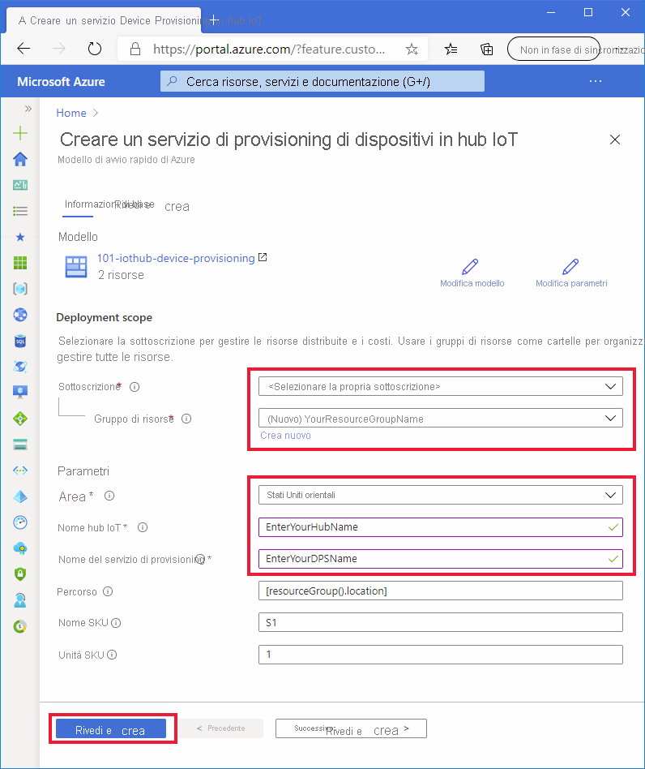

# <a name="quickstart-set-up-the-iot-hub-device-provisioning-service-dps-with-an-arm-template"></a>Avvio rapido: Configurare il servizio Device Provisioning in hub IoT con un modello di Resource Manager

È possibile usare un modello di [Azure Resource Manager](../azure-resource-manager/management/overview.md) per configurare a livello di codice le risorse cloud di Azure necessarie per il provisioning dei dispositivi. Queste procedure illustrano come creare un hub IoT e un nuovo servizio Device provisioning in hub IoT con un modello di Resource Manager. L'hub IoT viene inoltre collegato alla risorsa del servizio Device Provisioning (DPS) mediante il modello. Questo collegamento consente alla risorsa DPS di assegnare i dispositivi all'hub in base ai criteri di allocazione configurati.

[!INCLUDE [About Azure Resource Manager](../../includes/resource-manager-quickstart-introduction.md)]

Questo argomento di avvio rapido usa il [portale di Azure](../azure-resource-manager/templates/deploy-portal.md) e l'[interfaccia della riga di comando di Azure](../azure-resource-manager/templates/deploy-cli.md) per eseguire i passaggi a livello di codice necessari per creare un gruppo di risorse e distribuire il modello, ma è possibile usare facilmente [PowerShell](../azure-resource-manager/templates/deploy-powershell.md), .NET, Ruby o altri linguaggi di programmazione per eseguire queste procedure e distribuire il modello. 

Se l'ambiente in uso soddisfa i prerequisiti e si ha già familiarità con l'uso dei modelli di Resource Manager, selezionando il pulsante **Distribuisci in Azure** verrà aperto il modello per la distribuzione nel portale di Azure.

[](https://portal.azure.com/#create/Microsoft.Template/uri/https%3a%2f%2fraw.githubusercontent.com%2fAzure%2fazure-quickstart-templates%2fmaster%2f101-iothub-device-provisioning%2fazuredeploy.json)

[!INCLUDE [quickstarts-free-trial-note](../../includes/quickstarts-free-trial-note.md)]

[!INCLUDE [azure-cli-prepare-your-environment.md](../../includes/azure-cli-prepare-your-environment.md)]


## <a name="review-the-template"></a>Rivedere il modello

Il modello usato in questo avvio rapido proviene dai [modelli di avvio rapido di Azure](https://azure.microsoft.com/resources/templates/101-iothub-device-provisioning/).

> [!NOTE]
> Attualmente non è disponibile alcun supporto per i modelli ARM per la creazione di registrazioni con nuove risorse DPS. Si tratta di una richiesta comune e riconosciuta da considerare per l'implementazione.

:::code language="json" source="~/quickstart-templates/101-iothub-device-provisioning/azuredeploy.json":::

Nel modello indicato sopra sono definite due risorse di Azure:

* [**Microsoft.Devices/iothubs**](/azure/templates/microsoft.devices/iothubs): crea un nuovo hub IoT di Azure.
* [**Microsoft.Devices/provisioningservices**](/azure/templates/microsoft.devices/provisioningservices): crea un nuovo servizio Device Provisioning in hub IoT di Azure con il nuovo hub IoT già collegato.


## <a name="deploy-the-template"></a>Distribuire il modello

#### <a name="deploy-with-the-portal"></a>Eseguire la distribuzione con il portale

1. Selezionare l'immagine seguente per accedere ad Azure e aprire il modello per la distribuzione. Il modello crea un nuovo hub IoT e una nuova risorsa DPS. L'hub verrà collegato alla risorsa DPS.

    [](https://portal.azure.com/#create/Microsoft.Template/uri/https%3a%2f%2fraw.githubusercontent.com%2fAzure%2fazure-quickstart-templates%2fmaster%2f101-iothub-device-provisioning%2fazuredeploy.json)

2. Selezionare o immettere i valori seguenti e fare clic su **Rivedi e crea**.

        

    Se non diversamente specificato di seguito, usare il valore predefinito per creare l'hub IoT e la risorsa DPS.

    | Campo | Descrizione |
    | :---- | :---------- |
    | **Sottoscrizione** | Selezionare la sottoscrizione di Azure. |
    | **Gruppo di risorse** | Fare clic su **Crea nuovo**, immettere un nome univoco per il gruppo di risorse e quindi fare clic su **OK**. |
    | **Area** | Selezionare un'area per le risorse. Ad esempio **Stati Uniti orientali**. |
    | **Nome hub IoT** | Immettere per l'hub IoT un nome che sia univoco a livello globale all'interno dello spazio dei nomi *.azure-devices.net*. Questo nome sarà necessario nella sezione successiva per convalidare la distribuzione. |
    | **Provisioning Service Name** (Nome del servizio di provisioning) | Immettere un nome per la nuova risorsa del servizio Device Provisioning (DPS). Il nome deve essere univoco a livello globale all'interno dello spazio dei nomi *.azure-devices-provisioning.net*. Il nome della risorsa DPM sarà necessario nella sezione successiva per convalidare la distribuzione. |
    
3. Nella schermata successiva leggere le condizioni. Se si accettano tutte le condizioni, fare clic su **Crea**. 

    Il completamento della distribuzione richiederà pochi minuti. 

    Oltre al portale di Azure, è anche possibile usare Azure PowerShell, l'interfaccia della riga di comando di Azure e l'API REST. Per informazioni sugli altri metodi di distribuzione, vedere [Distribuire modelli](../azure-resource-manager/templates/deploy-powershell.md).


#### <a name="deploy-with-the-azure-cli"></a>Eseguire la distribuzione con l'interfaccia della riga di comando di Azure

È necessario usare la versione 2.6 o successiva dell'interfaccia della riga di comando di Azure. Se si esegue l'interfaccia della riga di comando di Azure localmente, verificare la versione eseguendo il comando `az --version`

Accedere al proprio account Azure e selezionare la sottoscrizione.

1. Se si esegue l'interfaccia della riga di comando di Azure localmente anziché nel portale, sarà necessario eseguire l'accesso. Per effettuare l'accesso al prompt dei comandi, eseguire il [comando login](/cli/azure/get-started-with-az-cli2):
    
    ```azurecli
    az login
    ```

    Seguire le istruzioni per l'autenticazione tramite il codice e accedere all'account Azure con un Web browser.

2. Se si usano più sottoscrizioni di Azure, effettuando l'accesso ad Azure è possibile accedere a tutti gli account Azure associati alle credenziali. Usare il seguente [comando per elencare gli account Azure](/cli/azure/account) che è possibile usare:
    
    ```azurecli
    az account list -o table
    ```

    Usare il comando seguente per selezionare la sottoscrizione che si vuole usare per eseguire i comandi per creare l'hub IoT e la risorsa DPS. È possibile usare il nome o l'ID della sottoscrizione dall'output del comando precedente:

    ```azurecli
    az account set --subscription {your subscription name or id}
    ```

3. Copiare e incollare i comandi seguenti nel prompt dell'interfaccia della riga di comando. Eseguire quindi i comandi premendo **INVIO**.
   
    > [!TIP]
    > Verrà chiesto di immettere una località per il gruppo di risorse. È possibile visualizzare un elenco di località disponibili eseguendo il comando seguente:
    >
    > `az account list-locations -o table`
    >
    >
    
    ```azurecli-interactive
    read -p "Enter a project name that is used for generating resource names:" projectName &&
    read -p "Enter the location (i.e. centralus):" location &&
    templateUri="https://raw.githubusercontent.com/Azure/azure-quickstart-templates/master/101-iothub-device-provisioning/azuredeploy.json" &&
    resourceGroupName="${projectName}rg" &&
    az group create --name $resourceGroupName --location "$location" &&
    az deployment group create --resource-group $resourceGroupName --template-uri  $templateUri &&
    echo "Press [ENTER] to continue ..." &&
    read
    ```

4. Verrà chiesto di immettere le informazioni seguenti. Specificare ogni valore e premere **INVIO**.

    | Parametro | Descrizione |
    | :-------- | :---------- |
    | **Nome progetto** | Il valore di questo parametro verrà usato per creare un gruppo di risorse che conterrà tutte le risorse. La stringa `rg` verrà aggiunta alla fine del valore del nome del gruppo di risorse. |
    | **location** | Questo valore è l'area in cui si troveranno tutte le risorse. |
    | **iotHubName** | Immettere per l'hub IoT un nome che sia univoco a livello globale all'interno dello spazio dei nomi *.azure-devices.net*. Questo nome sarà necessario nella sezione successiva per convalidare la distribuzione. |
    | **provisioningServiceName** | Immettere un nome per la nuova risorsa del servizio Device Provisioning (DPS). Il nome deve essere univoco a livello globale all'interno dello spazio dei nomi *.azure-devices-provisioning.net*. Il nome della risorsa DPM sarà necessario nella sezione successiva per convalidare la distribuzione. |

    Per distribuire il modello si usa l'interfaccia della riga di comando di Azure. Oltre all'interfaccia della riga di comando di Azure, è possibile usare anche Azure PowerShell, il portale di Azure e l'API REST. Per informazioni sugli altri metodi di distribuzione, vedere [Distribuire modelli](../azure-resource-manager/templates/deploy-powershell.md).


## <a name="review-deployed-resources"></a>Esaminare le risorse distribuite

1. Per verificare la distribuzione, eseguire questo [comando per elencare le risorse](/cli/azure/resource#az-resource-list) e cercare il nuovo servizio di provisioning e il nuovo hub IoT nell'output:

    ```azurecli
     az resource list -g "${projectName}rg"
    ```

2. Per verificare che l'hub sia già collegato alla risorsa DPS, eseguire questo [comando per visualizzare l'estensione DPS](/cli/azure/iot/dps#az_iot_dps_show).

    ```azurecli
     az iot dps show --name <Your provisioningServiceName>
    ```

    Si notino gli hub collegati al membro `iotHubs`.


## <a name="clean-up-resources"></a>Pulire le risorse

Altre guide di avvio rapido di questa raccolta si basano sulla presente guida di avvio rapido. Se si prevede di continuare a usare le guide di avvio rapido successive o le esercitazioni, non pulire le risorse create in questa guida di avvio rapido. Se non si prevede di continuare, è possibile usare il portale di Azure o l'interfaccia della riga di comando di Azure per eliminare il gruppo di risorse e tutte le relative risorse.

Per eliminare un gruppo di risorse e tutte le relative risorse dal portale di Azure, aprire il gruppo di risorse e fare clic su **Elimina gruppo di risorse** nella parte superiore.

Per eliminare il gruppo di risorse distribuito tramite l'interfaccia della riga di comando di Azure:

```azurecli
az group delete --name "${projectName}rg"
```

È anche possibile eliminare gruppi di risorse e singole risorse usando il portale di Azure, PowerShell o le API REST nonché gli SDK di piattaforma supportati pubblicati per Azure Resource Manager o il servizio Device Provisioning in hub IoT.

## <a name="next-steps"></a>Passaggi successivi

In questo argomento di avvio rapido sono stati distribuiti un hub IoT e un'istanza del servizio Device Provisioning e le due risorse sono state collegate. Per informazioni su come usare questa configurazione per effettuare il provisioning di un dispositivo, proseguire con l'argomento di avvio rapido per la creazione di un dispositivo.

> [!div class="nextstepaction"]
> [Avvio rapido per il provisioning di un dispositivo](./quick-create-simulated-device-symm-key.md)

