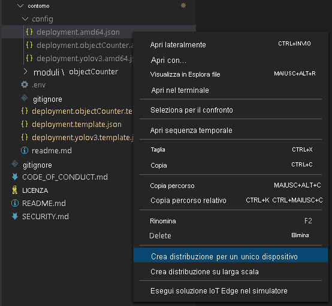
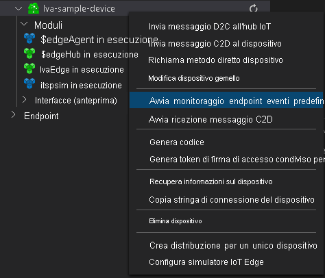

### <a name="examine-and-edit-the-sample-files"></a>Esaminare e modificare i file di esempio

Come parte dei prerequisiti, il codice di esempio è stato scaricato in una cartella. Seguire questa procedura per esaminare e modificare i file di esempio.

1. In Visual Studio Code passare a *src/edge*. Si noteranno il file *.env* e alcuni file modello di distribuzione.

    Il modello di distribuzione fa riferimento al manifesto della distribuzione per il dispositivo Edge. Include alcuni valori segnaposto. Il file *.env* include i valori per queste variabili.
1. Passare alla cartella *src/cloud-to-device-console-app*. Sono inclusi il file *appsettings.json* e alcuni altri file:

    * ***c2d-console-app.csproj***: il file di progetto per Visual Studio Code.
    * ***operations.json***: un elenco di operazioni che il programma dovrà eseguire.
    * ***Program.cs***: il codice del programma di esempio. Questo codice:

        * Carica le impostazioni dell'app.
        * Richiama i metodi diretti esposti dal modulo Analisi video live in IoT Edge. È possibile usare il modulo per analizzare i flussi video live richiamando i [metodi diretti](../../../direct-methods.md).
        * Sospende l'esecuzione per consentire di esaminare l'output del programma nella finestra **TERMINAL** e gli eventi generati dal modulo nella finestra **OUTPUT**.
        * Richiama i metodi diretti per pulire le risorse.
1. Modificare il file *operations.json*:
    * Cambiare il collegamento alla topologia del grafo:

        `"topologyUrl" : "https://raw.githubusercontent.com/Azure/live-video-analytics/master/MediaGraph/topologies/httpExtension/2.0/topology.json"`

    * In `GraphInstanceSet` modificare il nome della topologia del grafo in modo che corrisponda al valore nel collegamento precedente:

      `"topologyName" : "InferencingWithHttpExtension"`

    * In `GraphTopologyDelete` modificare il nome:

      `"name": "InferencingWithHttpExtension"`

### <a name="generate-and-deploy-the-iot-edge-deployment-manifest"></a>Generare e distribuire il manifesto della distribuzione di IoT Edge

1. Fare clic con il pulsante destro del mouse sul file *src/edge/ deployment.yolov3.template.json* e scegliere **Generate IoT Edge Deployment Manifest** (Genera manifesto della distribuzione di IoT Edge).

      

    Il file manifesto *deployment.yolov3.amd64.json* viene creato nella cartella *src/edge/config*.
1. Se è stato completato l'argomento di avvio rapido [Rilevare il movimento e generare eventi](../../../detect-motion-emit-events-quickstart.md), ignorare questo passaggio. 

    In caso contrario, accanto al riquadro **HUB IOT DI AZURE** nell'angolo in basso a sinistra selezionare l'icona **Altre azioni** e quindi selezionare **Set IoT Hub Connection String** (Imposta la stringa di connessione dell'hub IoT). È possibile copiare la stringa dal file *appsettings.json*. In alternativa, per assicurarsi di aver configurato l'hub IoT appropriato in Visual Studio Code, usare il comando [Selezionare un hub IoT](https://github.com/Microsoft/vscode-azure-iot-toolkit/wiki/Select-IoT-Hub).
    
    

    > [!NOTE]
    > Potrebbe essere richiesto di fornire informazioni di endpoint predefinite per l'hub Internet delle cose. Per ottenere tali informazioni, in portale di Azure passare all'hub Internet e cercare l'opzione **endpoint predefiniti** nel riquadro di spostamento a sinistra. Fare clic qui e cercare l' **endpoint compatibile con l'hub eventi** nella sezione **endpoint compatibile con hub eventi** . Copiare e usare il testo nella casella. L'endpoint sarà simile al seguente:  
        ```
        Endpoint=sb://iothub-ns-xxx.servicebus.windows.net/;SharedAccessKeyName=iothubowner;SharedAccessKey=XXX;EntityPath=<IoT Hub name>
        ```

1. Fare clic con il pulsante destro del mouse sul file *src/edge/config/ deployment.yolov3.amd64.json* e scegliere **Create Deployment for Single Device** (Crea la distribuzione per un unico dispositivo). 

    
1. Quando viene chiesto di selezionare un dispositivo hub IoT, selezionare **lva-sample-device**.
1. Dopo circa 30 secondi, nell'angolo in basso a sinistra della finestra aggiornare l'hub IoT di Azure. Il dispositivo Edge mostra ora i moduli distribuiti seguenti:

    * Il modulo Analisi video live, denominato `lvaEdge`.
    * Il modulo `rtspsim`, che simula un server RTSP e funge da origine di un feed video live.

        > [!NOTE]
        > I passaggi precedenti presuppongono che si stia usando la macchina virtuale creata dallo script di installazione. Se invece si usa il proprio dispositivo perimetrale, passare al dispositivo perimetrale ed eseguire i comandi seguenti con **diritti di amministratore** per estrarre e archiviare il file video di esempio usato per questa Guida introduttiva:  
        
        ```
        mkdir /home/lvaedgeuser/samples
        mkdir /home/lvaedgeuser/samples/input    
        curl https://lvamedia.blob.core.windows.net/public/camera-300s.mkv > /home/lvaedgeuser/samples/input/camera-300s.mkv  
        chown -R lvalvaedgeuser:localusergroup /home/lvaedgeuser/samples/  
        ```
        * Il modulo `yolov3`, ovvero il modello YoloV3 di rilevamento oggetti che applica la visione artificiale alle immagini e restituisce più classi di tipi di oggetto
 
      

### <a name="prepare-to-monitor-events"></a>Preparare il monitoraggio degli eventi

1. In Visual Studio Code aprire la scheda **Estensioni** (oppure premere CTRL+MAIUSC+X) e cercare Hub IoT di Azure.
1. Fare clic con il pulsante destro del mouse e scegliere **Impostazioni estensione**.

    > [!div class="mx-imgBorder"]
    > :::image type="content" source="../../../media/run-program/extensions-tab.png" alt-text="Impostazioni estensione":::
1. Cercare e abilitare "Show Verbose Message" (Visualizza messaggio dettagliato).

    > [!div class="mx-imgBorder"]
    > :::image type="content" source="../../../media/run-program/show-verbose-message.png" alt-text="Show Verbose Message":::
1. Fare clic con il pulsante destro del mouse sul dispositivo di Analisi video live e scegliere **Avvia monitoraggio endpoint eventi predefinito**. Questo passaggio è necessario per monitorare gli eventi dell'hub IoT nella finestra **OUTPUT** di Visual Studio Code. 

    

> [!NOTE]
> Potrebbe essere richiesto di fornire informazioni di endpoint predefinite per l'hub Internet delle cose. Per ottenere tali informazioni, in portale di Azure passare all'hub Internet e cercare l'opzione **endpoint predefiniti** nel riquadro di spostamento a sinistra. Fare clic qui e cercare l' **endpoint compatibile con l'hub eventi** nella sezione **endpoint compatibile con hub eventi** . Copiare e usare il testo nella casella. L'endpoint sarà simile al seguente:  
    ```
    Endpoint=sb://iothub-ns-xxx.servicebus.windows.net/;SharedAccessKeyName=iothubowner;SharedAccessKey=XXX;EntityPath=<IoT Hub name>
    ```
### <a name="run-the-sample-program"></a>Eseguire il programma di esempio

1. Per avviare la sessione di debug, premere F5. Verranno visualizzati i messaggi stampati nella finestra **TERMINALE**.
1. Il codice *operations.json* verrà avviato con le chiamate ai metodi diretti `GraphTopologyList` e `GraphInstanceList`. Se dopo aver completato gli argomenti di avvio rapido precedenti sono state pulite le risorse, questa procedura restituirà elenchi vuoti e quindi verrà sospesa. Per continuare, premere INVIO.

   ```
   --------------------------------------------------------------------------
   Executing operation GraphTopologyList
   -----------------------  Request: GraphTopologyList  --------------------------------------------------
   {
   "@apiVersion": "2.0"
   }
   ---------------  Response: GraphTopologyList - Status: 200  ---------------
   {
   "value": []
   }
   --------------------------------------------------------------------------
   Executing operation WaitForInput
   Press Enter to continue
   ```

    La finestra **TERMINALE** mostra il set successivo di chiamate ai metodi diretti:

     * Una chiamata a `GraphTopologySet` che usa `topologyUrl` precedente
     * Una chiamata a `GraphInstanceSet` che usa il corpo seguente:

         ```
         {
           "@apiVersion": "2.0",
           "name": "Sample-Graph-1",
           "properties": {
             "topologyName": "InferencingWithHttpExtension",
             "description": "Sample graph description",
             "parameters": [
               {
                 "name": "rtspUrl",
                 "value": "rtsp://rtspsim:554/media/camera-300s.mkv"
               },
               {
                 "name": "rtspUserName",
                 "value": "testuser"
               },
               {
                 "name": "rtspPassword",
                 "value": "testpassword"
               }
             ]
           }
         }
         ```

     * Una chiamata a `GraphInstanceActivate` che avvia l'istanza del grafo e il flusso di video
     * Una seconda chiamata a `GraphInstanceList` che mostra che l'istanza del grafo è in esecuzione
1. L'output della finestra **TERMINALE** viene sospeso in corrispondenza di una richiesta `Press Enter to continue`. Non premere ancora INVIO. Scorrere in alto per visualizzare i payload della risposta JSON per i metodi diretti richiamati.
1. Passare alla finestra **OUTPUT** in Visual Studio Code. Vengono visualizzati i messaggi inviati dal modulo Analisi video live in IoT Edge all'hub IoT. La sezione seguente di questo argomento di avvio rapido descrive questi messaggi.
1. Il grafo multimediale continua a essere eseguito e a stampare i risultati. Il simulatore RTSP continua a eseguire il video di origine in un ciclo. Quindi, per arrestare il grafo multimediale, tornare nella finestra **TERMINALE** e premere INVIO. 

    La serie successiva di chiamate pulisce le risorse:
      * Una chiamata a `GraphInstanceDeactivate` disattiva l'istanza del grafo.
      * Una chiamata a `GraphInstanceDelete` elimina l'istanza.
      * Una chiamata a `GraphTopologyDelete` elimina la topologia.
      * Una chiamata finale a `GraphTopologyList` mostra che l'elenco è vuoto.
