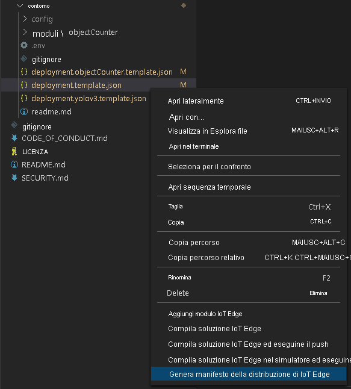

Il manifesto della distribuzione definisce i moduli che vengono distribuiti in un dispositivo perimetrale e le impostazioni di configurazione dei moduli. 

Seguire questa procedura per generare il manifesto dal file modello e quindi distribuirlo nel dispositivo perimetrale.

1. Aprire Visual Studio Code.
1. Accanto al riquadro **HUB IOT DI AZURE** selezionare l'icona **Altre azioni** per impostare la stringa di connessione dell'hub IoT. È possibile copiare la stringa dal file *src/cloud-to-device-console-app/appsettings.json*. 

    

> [!NOTE]
> Potrebbe essere richiesto di fornire informazioni di endpoint predefinite per l'hub Internet delle cose. Per ottenere tali informazioni, in portale di Azure passare all'hub Internet e cercare l'opzione **endpoint predefiniti** nel riquadro di spostamento a sinistra. Fare clic qui e cercare l' **endpoint compatibile con l'hub eventi** nella sezione **endpoint compatibile con hub eventi** . Copiare e usare il testo nella casella. L'endpoint sarà simile al seguente:  
    ```
    Endpoint=sb://iothub-ns-xxx.servicebus.windows.net/;SharedAccessKeyName=iothubowner;SharedAccessKey=XXX;EntityPath=<IoT Hub name>
    ```

1. Fare clic con il pulsante destro del mouse su **src/edge/deployment.template.json** e scegliere **Generate IoT Edge Deployment Manifest** (Genera manifesto della distribuzione di IoT Edge).

    

    Questa azione crea un file manifesto denominato *deployment.amd64.json* nella cartella *src/edge/config*.
1. Fare clic con il pulsante destro del mouse su **src/edge/config/deployment.amd64.json**, scegliere **Create Deployment for Single Device** (Crea la distribuzione per un unico dispositivo) e quindi selezionare il nome del dispositivo perimetrale.

    

1. Quando viene chiesto di selezionare un dispositivo hub IoT, scegliere **lva-sample-device** dal menu a discesa.
1. Dopo circa 30 secondi, nell'angolo in basso a sinistra della finestra aggiornare l'hub IoT di Azure. Il dispositivo perimetrale mostra ora i moduli distribuiti seguenti:

    * Analisi video live in IoT Edge (nome del modulo `lvaEdge`)
    * Simulatore RTSP (Real-Time Streaming Protocol) (nome del modulo `rtspsim`)

Il modulo del simulatore RTSP simula un flusso video live usando un file video copiato nel dispositivo perimetrale quando è stato eseguito lo [script di configurazione delle risorse di Analisi video live](https://github.com/Azure/live-video-analytics/tree/master/edge/setup). 

> [!NOTE]
> Se si usa un dispositivo perimetrale personalizzato invece del dispositivo sottoposto a provisioning dallo script di configurazione, passare al dispositivo perimetrale ed eseguire i comandi seguenti con **diritti di amministratore** per eseguire il pull e archiviare il file del video di esempio usato per questo avvio rapido:  

```
mkdir /home/lvaedgeuser/samples      
mkdir /home/lvaedgeuser/samples/input    
curl https://lvamedia.blob.core.windows.net/public/camera-300s.mkv > /home/lvaedgeuser/samples/input/camera-300s.mkv  
chown -R lvalvaedgeuser:localusergroup /home/lvaedgeuser/samples/  
```
A questo punto i moduli sono distribuiti ma non sono disponibili grafi multimediali attivi.
