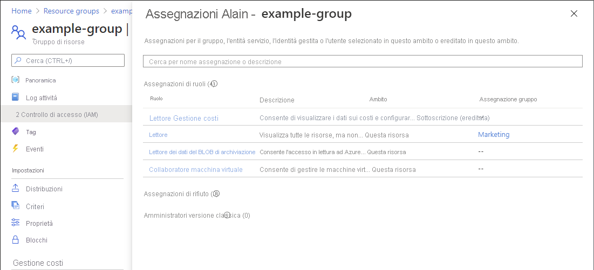

# Avvio rapido: Controllare l'accesso di un utente alle risorse di Azure

In alcune situazioni può essere necessario controllare l'accesso di un utente a un set di risorse di Azure. A questo scopo occorre visualizzare l'elenco delle assegnazioni dell'utente. Un modo rapido per controllare l'accesso per un singolo utente è tramite la funzionalità **Verifica l'accesso** nella pagina **Controllo di accesso (IAM)** .

## Passaggio 1: Aprire le risorse di Azure

Per verificare l'accesso per un utente, occorre prima di tutto aprire le risorse di Azure per cui si vuole controllare l'accesso. Le risorse di Azure sono organizzate in livelli che costituiscono l'*ambito*. In Azure è possibile specificare un ambito su quattro livelli, dal più ampio al più ristretto: gruppo di gestione, sottoscrizione, gruppo di risorse o risorsa.

Per aprire il set di risorse di Azure per cui si vuole controllare l'accesso, seguire questa procedura.

1. Aprire il [portale di Azure](https://portal.azure.com).

1. Aprire il set di risorse di Azure, ad esempio **Gruppi di gestione**, **Sottoscrizioni**, **Gruppi di risorse** o una determinata risorsa.

1. Fare clic sulla risorsa specifica in tale ambito.

    L'immagine seguente mostra un gruppo di risorse di esempio.

    

## Passaggio 2: Controllare l'accesso per un utente

Seguire questa procedura per controllare l'accesso di un singolo utente, gruppo, entità servizio o identità gestita alle risorse di Azure selezionate in precedenza.

1. Fare clic su **Controllo di accesso (IAM)**.

    L'immagine seguente mostra un esempio della pagina Controllo di accesso (IAM) per un gruppo di risorse.

    

1. Nell'elenco **Trova** della scheda **Verifica l'accesso** selezionare l'utente, il gruppo, l'entità servizio o l'identità gestita per cui si vuole controllare l'accesso.

1. Nella casella di ricerca, immettere una stringa per eseguire ricerche nella directory in base ai nomi visualizzati, agli indirizzi di posta elettronica o agli identificatori di oggetto.

    

1. Fare clic sull'entità di sicurezza per aprire il riquadro **Assegnazioni**.

    In questo riquadro è possibile visualizzare l'accesso per l'entità di sicurezza selezionata in questo ambito, oltre a quello ereditato da un altro ambito. Le assegnazioni in corrispondenza degli ambiti figlio non sono elencate. Vengono visualizzate le assegnazioni seguenti:

    - Assegnazioni di ruolo aggiunte con il controllo degli accessi in base al ruolo di Azure.
    - Assegnazioni di rifiuto aggiunte tramite Azure Blueprints o app gestite di Azure.
    - Assegnazioni classiche di amministratore del servizio e coamministratore per le distribuzioni classiche. 

    

## Passaggio 3: Verificare l'accesso

Seguire questa procedura per verificare il proprio accesso alle risorse di Azure selezionate in precedenza.

1. Fare clic su **Controllo di accesso (IAM)**.

1. Nella scheda **Verifica l'accesso** fare clic sul pulsante **Visualizzazione accesso personale**.

    Viene visualizzato un riquadro che mostra l'accesso dell'utente in questo ambito e quello ereditato da un altro ambito. Le assegnazioni in corrispondenza degli ambiti figlio non sono elencate.

    

## Passaggi successivi

> [!div class="nextstepaction"]
> [Elencare le assegnazioni di ruolo di Azure usando il portale di Azure](role-assignments-list-portal.md)
