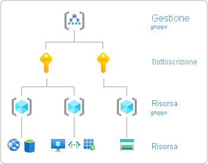

# Assegnare i ruoli di Azure usando il portale di Azure

[!INCLUDE [Azure RBAC definition grant access](../../includes/role-based-access-control/definition-grant.md)] Questo articolo descrive come assegnare i ruoli usando il portale di Azure.

Se è necessario assegnare ruoli di amministratore in Azure Active Directory, vedere [visualizzare e assegnare ruoli di amministratore in Azure Active Directory](../active-directory/roles/manage-roles-portal.md).

## Prerequisiti

[!INCLUDE [Azure role assignment prerequisites](../../includes/role-based-access-control/prerequisites-role-assignments.md)]

## Passaggio 1: identificare l'ambito necessario

[!INCLUDE [Scope for Azure RBAC introduction](../../includes/role-based-access-control/scope-intro.md)]

[!INCLUDE [Scope for Azure RBAC least privilege](../../includes/role-based-access-control/scope-least.md)] Per ulteriori informazioni sull'ambito, vedere [comprendere l'ambito](scope-overview.md).

1. Accedere al [portale di Azure](https://portal.azure.com).

1. Nella casella di ricerca nella parte superiore cercare l'ambito a cui si vuole concedere l'accesso. Ad esempio, cercare **gruppi di gestione**, **sottoscrizioni**, **gruppi di risorse** o una risorsa specifica.

    

1. Fare clic sulla risorsa specifica per tale ambito.

    L'immagine seguente mostra un gruppo di risorse di esempio.

    

## Passaggio 2: aprire il riquadro Aggiungi assegnazione ruolo

Il **controllo di accesso (IAM)** è la pagina che in genere si usa per assegnare i ruoli per concedere l'accesso alle risorse di Azure. È noto anche come gestione delle identità e degli accessi e viene visualizzato in diverse posizioni nel portale di Azure.

1. Fare clic su **Controllo di accesso (IAM)**.

    L'immagine seguente mostra un esempio della pagina Controllo di accesso (IAM) per un gruppo di risorse.

    

1. Fare clic sulla scheda **assegnazioni di ruolo** per visualizzare le assegnazioni di ruolo in questo ambito.

1. Fare clic su **Aggiungi**  >  **Aggiungi assegnazione ruolo**.
   Se non si dispone delle autorizzazioni per assegnare ruoli, l'opzione Aggiungi assegnazione di ruolo verrà disabilitata.

   

    Viene visualizzato il riquadro Aggiungi assegnazione di ruolo.

   

## Passaggio 3: selezionare il ruolo appropriato

1. Nell'elenco **ruolo** cercare o scorrere per trovare il ruolo che si desidera assegnare.

    Per determinare il ruolo appropriato, è possibile passare il mouse sull'icona info per visualizzare una descrizione del ruolo. Per altre informazioni, vedere l'articolo [ruoli predefiniti di Azure](built-in-roles.md) .

   

1. Fare clic per selezionare il ruolo.

## Passaggio 4: selezionare chi necessita di accesso

1. Nell'elenco **assegna accesso a** selezionare il tipo di entità di sicurezza a cui assegnare l'accesso.

    | Tipo | Descrizione |
    | --- | --- |
    | **Utente, gruppo o entità servizio** | Se si desidera assegnare il ruolo a un utente, a un gruppo o a un'entità servizio (applicazione), selezionare questo tipo. |
    | **Identità gestita assegnata dall'utente** | Se si desidera assegnare il ruolo a un' [identità gestita assegnata dall'utente](../active-directory/managed-identities-azure-resources/overview.md), selezionare questo tipo. |
    | *Identità gestita assegnata dal sistema* | Se si vuole assegnare il ruolo a un' [identità gestita assegnata dal sistema](../active-directory/managed-identities-azure-resources/overview.md), selezionare l'istanza del servizio di Azure in cui si trova l'identità gestita. |

   

1. Se è stata selezionata un'identità gestita assegnata dall'utente o un'identità gestita assegnata dal sistema, selezionare la **sottoscrizione** in cui si trova l'identità gestita.

1. Nella sezione **Seleziona** cercare l'entità di sicurezza immettendo una stringa o scorrendo l'elenco.

   

1. Dopo aver trovato l'entità di sicurezza, fare clic per selezionarla.

## Passaggio 5: assegnare un ruolo

1. Per assegnare il ruolo, fare clic su **Salva**.

   Dopo qualche istante, all'entità di sicurezza verrà assegnato il ruolo per l'ambito selezionato.

1. Nella scheda **assegnazioni di ruolo** verificare che nell'elenco sia visualizzata l'assegnazione di ruolo.

    

## Passaggi successivi

- [Assegnare un utente come amministratore di una sottoscrizione di Azure](role-assignments-portal-subscription-admin.md)
- [Rimuovere le assegnazioni di ruolo di Azure](role-assignments-remove.md)
- [Risolvere i problemi relativi a RBAC di Azure](troubleshooting.md)
