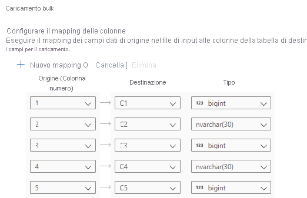

# Avvio rapido: Caricamento bulk con Synapse Studio

Il caricamento dei dati diventa facile con la procedura guidata Caricamento bulk di Synapse Studio. Synapse Studio è una funzionalità di Azure Synapse Analytics. La procedura guidata per il caricamento bulk consente di creare uno script T-SQL con l'[istruzione COPY](/sql/t-sql/statements/copy-into-transact-sql?view=azure-sqldw-latest&preserve-view=true) per eseguire il caricamento bulk dei dati in un pool SQL dedicato. 

## Punti di ingresso per la procedura guidata Caricamento bulk

È possibile eseguire il caricamento bulk dei dati facendo clic con il pulsante destro del mouse sull'area seguente all'interno di Synapse Studio: un file o una cartella di un account di archiviazione di Azure collegato all'area di lavoro.

## Prerequisiti

- La procedura guidata genera un'istruzione COPY che usa il pass-through di Azure Active Directory (Azure AD) per l'autenticazione. È necessario che l'[utente di Azure AD abbia accesso](./sql-data-warehouse/quickstart-bulk-load-copy-tsql-examples.md#d-azure-active-directory-authentication) all'area di lavoro con almeno il ruolo di Azure Collaboratore ai dati dei BLOB di archiviazione per l'account Azure Data Lake Storage Gen2. 

- Occorre avere le [autorizzazioni necessarie per l'uso dell'istruzione COPY](/sql/t-sql/statements/copy-into-transact-sql?view=azure-sqldw-latest&preserve-view=true#permissions) e le autorizzazioni per la creazione di tabelle, se viene creata una nuova tabella in cui caricare i dati.

- Il servizio collegato associato all'account di Azure Data Lake Storage Gen2 *deve avere accesso al file o alla cartella* da caricare. Se ad esempio il meccanismo di autenticazione del servizio collegato è un'identità gestita, l'identità gestita dell'area di lavoro deve avere almeno l'autorizzazione Lettore dei dati dei BLOB di archiviazione nell'account di archiviazione.

- Se nell'area di lavoro è abilitata una rete virtuale, assicurarsi che sia abilitata la creazione interattiva per il runtime integrato associato ai servizi collegati dell'account Azure Data Lake Storage Gen2 per la posizione dei dati di origine e del file di errori. La creazione interattiva è necessaria per il rilevamento automatico dello schema, la visualizzazione in anteprima del contenuto del file di origine e l'esplorazione degli account di archiviazione di Azure Data Lake Storage Gen2 all'interno della procedura guidata.

## Passaggi

1. Nel pannello **Posizione di archiviazione di origine** selezionare l'account di archiviazione e il file o la cartella da cui eseguire il caricamento. La procedura guidata tenta automaticamente di rilevare i file Parquet e i file di testo delimitato (CSV) e di eseguire il mapping dei campi di origine dal file ai tipi di dati SQL di destinazione appropriati. 

   

2. Selezionare le impostazioni del formato di file, incluse le impostazioni di errore in caso di righe rifiutate durante il processo di caricamento bulk. Per configurare le impostazioni del formato di file, è anche possibile selezionare **Anteprima dati** per vedere come verrà analizzato il file dall'istruzione COPY. Selezionare **Anteprima dati** ogni volta che si cambia un'impostazione del formato di file per vedere come verrà analizzato il file dall'istruzione COPY con l'impostazione aggiornata.

    

   > [!NOTE]  
   >
   > - La procedura guidata per il caricamento bulk non supporta la visualizzazione in anteprima dei dati con caratteri di terminazione del campo multipli. Se si specificano caratteri di terminazione del campo multipli, la procedura guidata visualizza l'anteprima dei dati in una sola colonna. 
   > - Se si seleziona **Deduci nomi di colonna**, la procedura guidata per il caricamento bulk analizza i nomi di colonna a partire dalla prima riga specificata nel campo **Prima riga**. La procedura guidata per il caricamento bulk incrementa automaticamente di 1 il valore `FIRSTROW` nell'istruzione COPY per ignorare questa riga di intestazione. 
   > - La specifica di caratteri di terminazione del campo multipli è supportata nell'istruzione COPY. La procedura guidata per il caricamento bulk, invece, non la supporta e genererà quindi un errore.

3. Selezionare il pool SQL dedicato usato per il caricamento, specificando anche se il caricamento verrà eseguito per una tabella esistente o per una nuova.
   
4. Selezionare **Configura mapping colonne** per assicurarsi di avere il mapping di colonne appropriato. Se l'opzione **Deduci nomi di colonna** è abilitata, i nomi delle colonne vengono rilevati automaticamente. Per le nuove tabelle, la configurazione del mapping delle colonne è fondamentale per l'aggiornamento dei tipi di dati delle colonne di destinazione.

   
5. Selezionare **Apri script**. Viene generato uno script T-SQL con l'istruzione COPY per eseguire il caricamento dal data lake.
   

## Passaggi successivi

- Per altre informazioni sulle funzionalità di COPY, vedere l'articolo [Istruzione COPY](/sql/t-sql/statements/copy-into-transact-sql?view=azure-sqldw-latest&preserve-view=true#syntax).
- Per informazioni sull'uso di un processo di estrazione, trasformazione e caricamento (ETL), vedere l'articolo [Panoramica sul caricamento dei dati](./sql-data-warehouse/design-elt-data-loading.md#what-is-elt).
