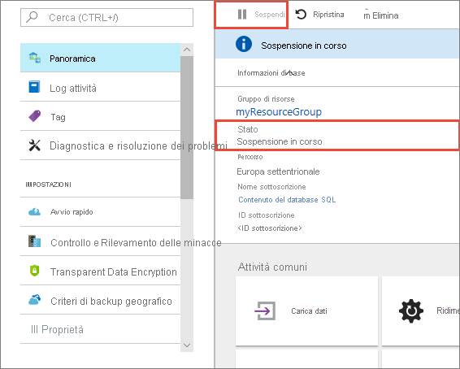
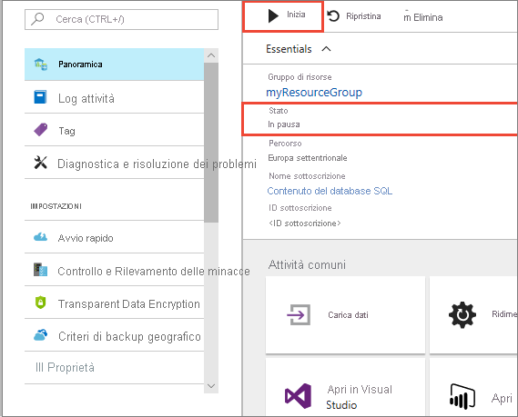
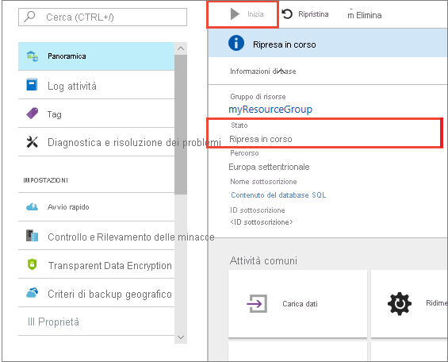
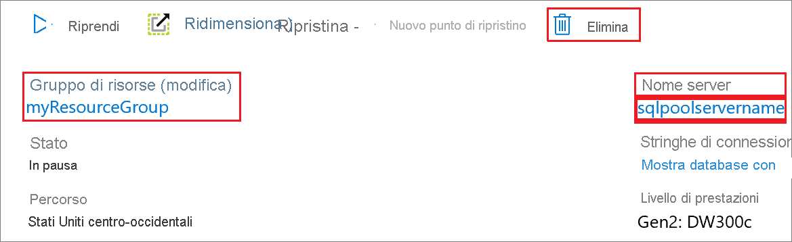

# Avvio rapido: Sospendere e riprendere l'esecuzione delle risorse di calcolo in un pool SQL dedicato con il portale di Azure

È possibile usare il portale di Azure per sospendere e riprendere l'esecuzione delle risorse di calcolo del pool SQL dedicato. Se non si ha una sottoscrizione di Azure, creare un account [gratuito](https://azure.microsoft.com/free/) prima di iniziare.

## Accedere al portale di Azure

Accedere al [portale di Azure](https://portal.azure.com/).

## Prima di iniziare

Vedere [Creare e connettere - Portale](../quickstart-create-sql-pool-portal.md) per creare un pool SQL dedicato denominato **mySampleDataWarehouse**. 

## Sospendere le risorse di calcolo

Per ridurre i costi, è possibile sospendere e riprendere le risorse di calcolo su richiesta. Ad esempio, se non si usa il database durante la notte e nei fine settimana, è possibile sospenderlo in questi intervalli di tempo e riprenderne l'esecuzione durante il giorno.
 
>[!NOTE]
>Mentre il database è sospeso, non verranno addebitati costi per le risorse di calcolo. Continueranno tuttavia a essere applicati addebiti per l'archiviazione. 

Seguire questa procedura per sospendere un pool SQL dedicato:

1. Accedere al [portale di Azure](https://portal.azure.com/).
2. Passare alla pagina **Pool SQL dedicato** per aprire il pool SQL. 
3. Si noti che **Stato** è impostato su **Online**.

    

4. Per sospendere il pool SQL dedicato, fare clic sul pulsante **Sospendi**. 
5. Viene visualizzato un messaggio in cui viene chiesto se si vuole continuare. Fare clic su **Sì**.
6. Attendere qualche minuto e quindi verificare che lo **Stato** sia **Sospensione**.

    

7. Al termine dell'operazione di sospensione, lo stato diventa **Sospeso** e il pulsante di opzione è **Riprendi**.
8. Le risorse di calcolo per il pool SQL dedicato sono ora offline. Non verranno addebitate le risorse di calcolo fino al ripristino del servizio.

    

## Riavviare le risorse di calcolo

Seguire questa procedura per riprendere un pool SQL dedicato.

1. Passare alla pagina **Pool SQL dedicato** per aprire il pool SQL.
3. Nella pagina **mySampleDataWarehouse** verificare che **Stato** sia **Sospeso**.

    

1. Per riprendere il pool SQL, fare clic su **Riprendi**. 
1. Viene visualizzato un messaggio in cui viene chiesto se si vuole avviare. Fare clic su **Sì**.
1. Si noti che lo **Stato** è **Ripresa**.

    

1. Quando il pool SQL è di nuovo online, lo stato diventa **Online** e il pulsante di opzione è **Sospendi**.
1. Le risorse di calcolo per il pool SQL sono ora online ed è possibile usare il servizio. Verranno ripresi gli addebiti per il calcolo.

    

## Pulire le risorse

Verranno addebitati i costi per le unità Data Warehouse e per i dati archiviati nel pool SQL dedicato. Le risorse di calcolo e archiviazione vengono fatturate separatamente. 

- Se si vogliono mantenere i dati nelle risorse di archiviazione, sospendere il calcolo.
- Per evitare di ricevere addebiti in futuro, è possibile eliminare il pool SQL dedicato. 

Seguire questa procedura per pulire le risorse nel modo desiderato.

1. Accedere al [portale di Azure](https://portal.azure.com) e selezionare il pool SQL dedicato.

    

1. Per sospendere il calcolo, fare clic sul pulsante **Pausa**. 

1. Per rimuovere il pool SQL dedicato in modo da non ricevere addebiti per risorse di calcolo o di archiviazione, fare clic su **Elimina**.

## Passaggi successivi

Le risorse di calcolo del pool SQL dedicato sono state sospese e riprese. Per altre informazioni, vedere l'articolo successivo, [Caricare i dati in un pool SQL dedicato](./load-data-from-azure-blob-storage-using-copy.md). Per altre informazioni sulla gestione delle funzionalità di calcolo, vedere l'articolo [Panoramica sulla gestione delle risorse di calcolo](sql-data-warehouse-manage-compute-overview.md).